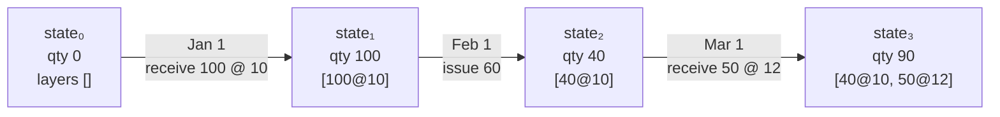
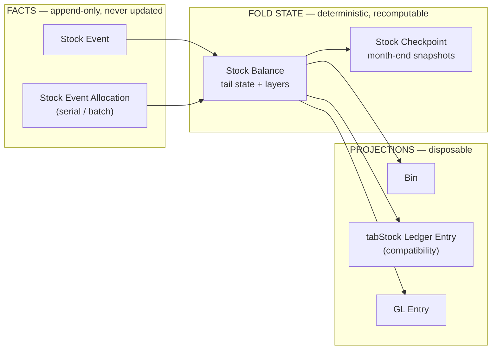
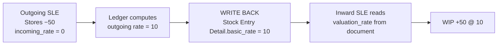

# Stock Engine Redesign — Architecture Design Doc

## Context

ERPNext's Stock module generates a persistent, recurring class of bugs: wrong valuation rates,
reposting failures and timeouts, negative quantities that slip through, stock-vs-account balance
mismatches, serial/batch inconsistencies, and poor performance at scale. The hypothesis behind this
work is that these are not independent bugs but **symptoms of one architectural decision made over a
decade ago**, compounded by a decade of patches.

The exploration confirms the hypothesis.

**Deliverable:** a written architecture design doc. **No implementation in this phase.**

**This document lives at** `erpnext/stock/spec/stock_engine_redesign.md`. When it is upstreamed,
the natural home is `erpnext/stock/spec/redesign.md`, alongside the existing `spec/README.md` and
`spec/reposting.md`.

**Related fix:** `spec/reposting.md` is stale and should be corrected. It documents a 25-minute
repost budget and an hourly `repost_entries` entry point, but `repost_time_limit` no longer exists
anywhere in the codebase and parallel reposting runs on a 15-minute cron.

**Related discussion:** [Towards a provably correct Stock Ledger](https://gameplan.frappe.cloud/g/community/erpnext/space/108/discussion/5675)
— internal Gameplan thread (Ankush, Rushabh) that independently converges on this architecture.
Its testing ladder is adopted in §2.14, its one-row-per-unit proposal is addressed in §2.1, and its
POC-first sequencing shapes the milestones in Part 4.

### Decisions already settled

- **Scope:** ledger + valuation core, serial & batch, accounting integration, concurrency &
  performance — all four.
- **Compatibility:** must migrate live installs. `tabStock Ledger Entry` stays readable for
  third-party apps (Part 4, Phase 3).
- **Stock Reconciliation is modelled as an assertion, not a delta** (§2.1). Confirmed.
- **Negative stock is kept, not removed** (§2.10), with true-up to a **dedicated variance account** so
  the cost of running negative is visible in the P&L rather than buried in COGS. Confirmed.

### The evidence, in one number

The stock module ships **eleven reports whose only purpose is to detect that the stock ledger has
become internally inconsistent**, plus a weekly auto-repair job and a manual "Recalculate Batch Qty"
button:

`stock_ledger_invariant_check`, `stock_ledger_variance`, `incorrect_balance_qty_after_transaction`,
`incorrect_stock_value_report`, `incorrect_serial_no_valuation`, `incorrect_serial_and_batch_bundle`,
`stock_and_account_value_comparison`, `fifo_queue_vs_qty_after_transaction_comparison`,
`stock_qty_vs_batch_qty`, `stock_qty_vs_serial_no_count`, `negative_batch_report`.

A system that needs eleven consistency checkers does not have a bug problem. It has a **design that
permits inconsistency**.

---

## Part 1 — Diagnosis: why the current model corrupts

### 1.1 Root cause: derived state is materialized on every ledger row

`Stock Ledger Entry` has 36 fields. Alongside the actual facts it stores four *derived* values on
**every row**: `qty_after_transaction` (running sum of `actual_qty`), `stock_value` (running sum of
`stock_value_difference`), `valuation_rate` (`stock_value / qty`), and `stock_queue` — **the entire
FIFO queue, as a JSON blob, copied onto every row**.

Look at what `stock_ledger_invariant_check` actually verifies:

```python
balance_qty += sle.actual_qty
balance_stock_value += sle.stock_value_difference
sle.difference_in_qty = sle.qty_after_transaction - balance_qty
sle.diff_value_diff   = balance_stock_value - sle.stock_value
```

It replays the ledger and checks that the stored running totals match the computed ones. **These
would be tautologies if the values were derived instead of stored.** The report exists only because
the same fact is written in four places and they are allowed to disagree.

This single decision causes, directly: **reposting exists at all** (stored running totals mean a
backdated entry invalidates every subsequent row), and **every corruption class above** (four
redundant representations = four opportunities to drift).

### 1.2 Reposting is a rewrite of history, and it is fragile

`update_entries_after` (`stock/stock_ledger.py:572-1918`) is ~1350 lines — half the file. Lowercase
class name (unrenamed since 2013), constructor with side effects, max nesting depth 7, and a 188-line
`process_sle`. It:

- Loads **every** future SLE for an item-warehouse into a Python `deque` with `FOR UPDATE` and **no
  LIMIT**. A deep backdate materializes millions of rows in memory and holds range locks.
- Issues **one `frappe.get_doc(sle).db_update()` per row** — no bulk write path exists.
- Commits every 2000 rows, *releasing those locks mid-flight*.
- Fans out via `dependant_sle_voucher_detail_no`, appending SLEs and **re-sorting the entire deque**
  per discovery — O(n log n) each time.
- **Writes back into source documents.** `update_outgoing_rate_on_transaction` (`:1519`) rewrites
  `Stock Entry Detail.basic_rate`, `Delivery Note Item.incoming_rate`, `Purchase Receipt
  Item.valuation_rate`, reloading and re-saving the parent voucher *per SLE*.

Reposting state is split across two stores that can disagree: DB columns on `Repost Item Valuation`
**and a gzipped JSON file attachment** holding `repost_affected_transaction`. Verified at
`stock_ledger.py:556-559`:

```python
try:
    data = gzip.decompress(content)
except Exception:
    return frappe._dict()
```

A bare swallow. **If that file is lost or corrupt, affected vouchers silently drop out of GL
reposting** — producing a stock/account mismatch with no error.

And `RepostItemValuation.reset_field_values()` unconditionally sets `allow_negative_stock = 1`
(`repost_item_valuation.py:227`). **Every background repost is negative-stock-blind by
construction.**

### 1.3 The accounting seam

One SLE ⇒ two GL lines valued at `stock_value_difference`. When reposting changes that value:

```python
_delete_accounting_ledger_entries(voucher_type, voucher_no)   # hard DELETE FROM `tabGL Entry`
voucher_obj.make_gl_entries(gl_entries=expected_gle, from_repost=True)
```

Three structural problems:

1. **Physical DELETE, not reversal** (`accounts/utils.py:1729`) — no audit trail of what the books
   said before.
2. **The DELETE has no period/freeze/PCV check at all**, and `from_repost=True` skips
   `validate_frozen_account`, `validate_party`, `validate_cost_center`, `check_pl_account`. RIV
   validates freeze rules at *create* time, not *execute* time — a period can close while an RIV
   sits `Queued`.
3. **Committed per 100-voucher chunk** (`GL_REPOSTING_CHUNK = 100`). A failure in chunk N does not
   roll back chunks 1..N-1, leaving the books half-rewritten.

Combined with the silently-dropped affected-voucher set, this is the direct mechanism behind "stock
and account balance mismatch."

### 1.4 Two live serial/batch implementations

Both run **simultaneously**, at three levels:

- *Data*: `SLE.serial_no` (newline-separated Long Text, queried with 4-way `LIKE` and a `REGEXP`) and
  `SLE.batch_no` still exist and are still read.
- *Code*: `SerialNoValuation` / `BatchNoValuation` **inherit from** `DeprecatedSerialNoValuation` /
  `DeprecatedBatchNoValuation` and call the deprecated methods **unconditionally on every outward
  movement**.
- *Per-batch*: `Batch.use_batchwise_valuation` is set only on insert, and a v14 patch zeroed it for
  **all** pre-v14 batches — so one item+warehouse can hold batchwise and non-batchwise batches at
  once, valued by different algorithms.

`Serial and Batch Bundle` is 3701 lines. Its `Serial and Batch Entry` child rows duplicate 7 header
fields onto every row **and carry their own `stock_queue` JSON** — the queue-on-every-row problem
replicated a second time.

### 1.5 Denormalized caches with no owner

| Cache | Problem |
|---|---|
| `Bin.actual_qty`, `reserved_qty`, `ordered_qty`, … | **Full-row clobbering under zero locking.** See below — the bug is subtler than simple accumulation drift. |
| `Serial No.warehouse`, `.status` | Bulk raw `UPDATE`s, no history. Outward validated against *the denormalized column*, not the ledger — hence the `ignore_warehouse` escape hatch backdating needs. |
| `Batch.batch_qty` | Incremental read-modify-write, **warehouse-agnostic global total**, **not updated during repost**. Has a manual "Recalculate Batch Qty" button *and* a drift report — three admissions it doesn't work. |

#### 1.5.1 The `Bin` commitment fields — the real bug is clobbering, not drift

Worth stating precisely, because the obvious diagnosis is wrong. **All seven commitment fields are
already recomputed from source**, each at its own write site — `reserved_qty` from open Sales Order
Items, `ordered_qty` from open POs/SCOs, `reserved_qty_for_production` from Work Order Items, and so
on. There is no `bin.field + delta` accumulation anywhere. So the design intent is right. Four things
break it:

1. **Full-row writes.** Both `stock_balance.update_bin_qty` and `bin.update_qty` end in
   `bin.db_update()` / a multi-field `set_value`, writing **the whole row**. A projector that
   correctly recomputes *its own* field simultaneously clobbers every *other* field with whatever it
   read moments earlier. With **zero row locking** anywhere on Bin, concurrent SO submit + PO submit +
   SLE write lose each other's values.
2. **A guaranteed-zero delta on every SLE.** `bin.update_qty` computes `reserved_qty =
   bin_details.reserved_qty + args.get("reserved_qty")`, but `args` is `sle_doc.as_dict()`, which
   never contains those keys. So every stock movement reads the four commitment fields and writes
   them straight back — a pure clobber window that does no useful work.
3. **Two formulas for one concept.** `reserved_stock` is computed as a **4-term** expression
   (`reserved - delivered - transferred - consumed`) at `stock_reservation_entry.py:803` and
   `stock_ledger.py:633`, but as a **2-term** expression (`reserved - delivered`) at `:826`, in the
   v15 backfill patch, and in the Stock Balance report. They disagree whenever a Work Order flow makes
   `transferred_qty` or `consumed_qty` nonzero. Likewise there are **two `get_available_qty_to_reserve`
   implementations** — one locked (`:693`), one not (`:1270`).
4. **Missed invocation.** Because correctness depends on every source-doc mutation remembering to call
   its recompute, a path that forgets drifts permanently. There is **no scheduled reconciliation** —
   all repair is a manual button (`Bin.recalculate_values`, which notably skips `reserved_stock`) or a
   one-shot patch.

**POS reservations are invisible to all of it.** POS holds are a query-time subtraction
(`get_pos_reserved_qty`) that never touches Bin, so they are absent from `projected_qty`, from
negative-stock validation, and from SRE availability. Two POS terminals and a Sales Order reservation
cannot see one another.

### 1.6 Reports replay all of history

- **Stock Balance** streams every SLE in the period and aggregates in Python. Its only optimization
  is an *optional* `Stock Closing Entry`.
- **Stock Ageing** selects **every SLE for the company** `<= to_date` — no from-date, no snapshot —
  and replays the full FIFO queue in Python.

### 1.7 Concurrency is dialect-dependent and partial

Postgres uses advisory locks; MariaDB relies on *incidental gap locks* from `FOR UPDATE` previous-SLE
reads — not a design at all. The synchronous submit path is deliberately **not** gated. No retry
decorators. The in-code comment states the model honestly: *"without this gate two concurrent writers
compute from the same stale previous SLE and the loser's Bin write is lost."*

---

### 1.8 Case study: Landed Cost Voucher, where every pathology meets

LCV is worth isolating because it exhibits all of Part 1 at once, and because three open upstream
issues (§2.8.1) are about it.

**It rewrites history by cancelling and resubmitting the receipt** (`landed_cost_voucher.py:340-355`).
The receipt's `docstatus` is mutated **in memory only** — never written — to force the ledger down the
cancel branch and back:

```python
doc.docstatus = 2
doc.update_stock_ledger(allow_negative_stock=True, via_landed_cost_voucher=True)
doc.make_gl_entries_on_cancel()
doc.docstatus = 1
doc.update_stock_ledger(allow_negative_stock=True, via_landed_cost_voucher=True)
doc.make_gl_entries(via_landed_cost_voucher=True)
doc.repost_future_sle_and_gle(via_landed_cost_voucher=True)
```

**This happens on cancel too** — `on_submit` and `on_cancel` call the *same* function. So the ledger
accumulates **one full extra generation of `is_cancelled=1` SLEs per LCV submit and per LCV cancel**.

**It carries 21 distinct bypass sites.** The `via_landed_cost_voucher` flag threads through the entire
stack, and what it disables is not incidental:

| Site | What it turns off |
|---|---|
| `stock_ledger_entry.py:184` | **The whole `SerialBatchBundle` valuation pass on SLE submit** |
| `stock_ledger.py:1037` | Negative-stock validation **for serialized items** |
| `serial_batch_bundle.py:1574` | Negative-batch guard — and a negative `batch_qty` is then **persisted** |
| `serial_and_batch_bundle.py:963` | The "future entries exist for this serial/batch" check |
| `serial_batch_bundle_service.py:212` | `do_not_submit` is **inverted** — bundles auto-submit under LCV |
| `serial_batch_bundle_service.py:162` | Bundle-vs-legacy-field consistency check |
| `stock_ledger.py:177` | `update_entries_after` for the **cancel leg** — valuation never recomputed for it |
| `repost_item_valuation.py:416,450` | LCV reposts are **excluded from dedup**, so they always run in full |

Two of the flags are **dead**: `_make_tax_gl_entries(..., via_landed_cost_voucher)` never reads the
parameter, and `update_valuation_rate(reset_outgoing_rate=False)` declares a parameter
(`buying_controller.py:425`) that appears nowhere in the body. Nobody can tell which of the 21 are
load-bearing.

**One thing here is genuinely well designed and should be preserved.** Reversal is
**recompute-from-source, not delta-based**: `set_landed_cost_voucher_amount` (`:532-551`) re-sums
`applicable_charges` across *all* submitted LCVs filtered on `docstatus == 1`. Cancelling therefore
reverses correctly because the cancelled voucher simply drops out of the sum. That is exactly the
"set, don't increment" principle §2.7 applies to `Bin` — the LCV author got it right, and the pattern
should be generalized rather than discarded.

**Test coverage of cancellation is zero.** All six `lcv.cancel()` calls in the 1425-line test file are
teardown; **no test asserts anything after a cancel** — not valuation, not `stock_value`, not GL, not
`Asset.net_purchase_amount`, not `Serial No.purchase_rate`, not `Batch.batch_qty`. Also untested:
`distribute_charges_based_on = "Qty"` and `"Distribute Manually"` (every helper hard-codes
`"Amount"`), `receipt_document_type = "Stock Entry"`, the modern (non-legacy) batch bundle path, and
**every one of the negative-stock bypasses above**.

### 1.9 Why reposting rewrites documents: the document is a message bus

This is the deepest structural problem in the current engine, and it explains §1.2's most alarming
behaviour.

A transfer, Repack, Manufacture, or Subcontracting Receipt produces **two coupled legs**: stock leaves
warehouse A and enters warehouse B. The outgoing rate is *not an input* — it is produced by A's FIFO
queue or moving average at posting time. The incoming leg needs that number.

But reposting is scoped **per `(item_code, warehouse)`** — `update_entries_after` handles one pair at
a time. So the two legs are processed by different runs, with no shared memory. **The only channel
between them is the source document.** Hence `update_outgoing_rate_on_transaction`
(`stock_ledger.py:1519`) writes the realized rate back into `Stock Entry Detail.basic_rate`, and the
inward leg later reads it back via `get_incoming_outgoing_rate_from_transaction` (`:1410`), which
*first* calls `recalculate_amounts_in_stock_entry` to re-derive the parent totals.

The submitted document is being used as **mutable shared state between two ledger passes.** That is
why:

- Reposting mutates submitted transactional documents at all.
- Every write-back handler needs `for_update=True` / `get_lazy_doc`.
- `dependant_sle_voucher_detail_no` exists — to make the repost walk transitive across pairs.
- `distinct_dependant_item_wh` exists — to stop the fan-out cycling.
- The deque must be re-sorted on every dependency discovery.

The write-back surface is large: `Stock Entry` (whole doc + selected rows), `Delivery Note Item`,
`Sales Invoice Item`, `Packed Item`, `Purchase Receipt Item`, `Purchase Receipt Item Supplied`,
`Subcontracting Receipt Item`, `Subcontracting Receipt Supplied Item`, `Stock Reconciliation`, plus
six more via the serial/batch bundle path.

**Two holes this design leaves open:**

- **`Material Consumption for Manufacture` gets no dependency edge at all** —
  `get_finished_item_row` returns `None` for that purpose — yet `_fetch_consumption_entry_cost` makes
  the Manufacture entry's FG rate depend on those entries. The dependency is real but structurally
  invisible to the repost walk.
- **Process loss is absorbed silently.** It reduces FG quantity but not consumed cost, so the loss is
  buried in the surviving units' rate. There is no loss SLE and no expense booking — only a report.

**In the target design this entire mechanism disappears.** A multi-leg voucher is folded as **one
atomic unit**: the fold computes A's outgoing cost and applies it directly as B's inward cost, in
memory, in one transaction (§2.7 already locks all keys of a voucher together, in sorted order).
There is no second pass to inform, so there is nothing to write back, no dependency pointer to store,
no transitive fan-out to bound, and no re-sorting. Documents become immutable after submit. The
`dependant_sle_voucher_detail_no` column, `include_dependant_sle_in_reposting`,
`distinct_dependant_item_wh`, and every write-back handler are deleted.

*Testing note:* this area is thinly covered. **No test asserts the finished-good SLE's valuation
rate after a backdated raw-material change on a `Manufacture` entry** — the canonical
`test_item_cost_reposting` covers Repack, which takes a different branch, and
`test_backdated_manufacture_repost_skips_redundant_dependent` is also Repack-based despite its name
and only asserts a repost status. Multi-hop transitivity across *different items* is untested, as is
the FG branch of `update_rate_on_subcontracting_receipt`.

---

## Part 2 — Target architecture

> **Facts are stored. Everything else is computed. State lives in snapshots, not on ledger rows.**

Three tiers, and the boundary between them is the whole design:

| Tier | Mutability | Contents | If lost |
|---|---|---|---|
| **Facts** | Append-only, never updated | `Stock Event`, `Stock Event Allocation` | Catastrophic — this is the truth |
| **Fold state** | Rewritable, deterministic | `Stock Balance` (tail), `Stock Checkpoint` (history) | Recomputable from facts |
| **Projections** | Rewritable, disposable | `Bin`, `Serial No Position`, `tabStock Ledger Entry` (compat), GL | Recomputable (GL: *correctable*) |

**A note on "stateless", since that word carries weight internally.** Quantity is a *sum* —
commutative and order-free, recomputable by pure aggregation exactly like a GL balance, and
genuinely stateless. Valuation is a *fold* — path-dependent and non-commutative: the FIFO cost of
an issue depends on the ordered sequence of every movement before it, and no design choice makes
that a sum. "As stateless as possible" therefore cannot mean "no derived state"; it means **no
authoritative derived state** — everything derived is recomputable from facts, stored once per key
rather than on every row, and nothing correctness-critical trusts it. That is what the three tiers
above formalize.

### 2.1 `Stock Event` — the immutable fact table

~16 columns versus 36:

```
id                bigint PK (autoname: autoincrement)
company, item_code, warehouse, dimension_key
posting_datetime
event_kind        Receipt | Issue | Assertion | Reversal | Opening
qty_change        signed; NULL for Assertion
assert_qty, assert_rate    NULL except Assertion
declared_rate     inward only; NULL for Issue
voucher_type, voucher_no, voucher_row
reverses_event    NULL unless Reversal
fact_hash         SHA-256 over fact columns
```

**Deleted from the fact row:** `qty_after_transaction`, `stock_value`, `valuation_rate`,
`stock_value_difference`, `stock_queue`, `outgoing_rate`, `serial_no`, `batch_no`, `is_cancelled`,
`recalculate_rate`, `to_rename`, `dependant_sle_voucher_detail_no`, `fiscal_year`, `has_batch_no`,
`has_serial_no`, `posting_date`/`posting_time` (store the instant, derive the parts — inverting
today's denormalization).

Three consequences worth stating plainly:

- **Cancellation becomes a reversing event**, not an `is_cancelled` flag flipped by bulk UPDATE.
- **Outward movements carry no rate.** The rate at which stock leaves is a *function of policy and
  prior state*, never an input. Today `outgoing_rate` is stored and then rewritten during reposting,
  and that rewrite is what corrupts source documents.
- **A Stock Reconciliation is an assertion, not a delta.** Store "on this date the balance IS 40 at
  rate 12"; let the fold compute the implied delta when it actually knows the prior balance. Today
  ERPNext converts it to a delta at write time, which is why `get_stock_reco_qty_shift` and
  `get_next_stock_reco` exist and why backdating around a reco is pathological.

*Rejected — one ledger row per physical unit (no qty column).* Proposed in the internal discussion:
quantity as row-existence, reservation via `SELECT … FOR UPDATE SKIP LOCKED`. Three problems are
fatal for the *ledger*. Fractional and continuous UOMs (kg, litres, metres) have no unit rows, so a
parallel model would be needed anyway — recreating the dual-implementation problem this rewrite
exists to remove. A 10,000-unit receipt becomes 10,000 inserts, and every availability check still
needs the aggregate, so you either scan millions of rows or cache the count — and the cache is Bin
again: the state moves, it does not disappear. And negative stock becomes structurally impossible
(a table cannot hold −3 rows), silently reversing the settled §2.10 decision. What the idea gets
right is kept: `SKIP LOCKED` is the right pattern for the reservation/picking layer, and serialized
items get exactly one-row-per-unit granularity through §2.6's ±1 allocations — unit grain where the
business actually tracks units.

### 2.2 Deterministic ordering

Today's sort key `(posting_datetime, creation)` is broken twice over: `creation` is wall-clock (NTP
steps and multi-node skew can invert it; it collides under concurrent load, after which order is
whatever the storage engine feels like), and it is **mutated** — `stock_ledger.py:264` does
`db_set("creation", ...)` for reposted Stock Recos. An order key you mutate is not an order key.

**Order key: `(posting_datetime, id)`** where `id` is a database-assigned monotonic bigint (Frappe's
`autoname: autoincrement` → MariaDB `AUTO_INCREMENT` / Postgres sequence; portable). Total, stable,
immutable, clock-independent.

Backdating needs no special handling: a backdated event gets an early `posting_datetime` and a high
`id`. The sort key handles it. **History is never rewritten to make room.**

*Rejected — a gapless per-(item, warehouse) ordinal on the fact table.* Superficially attractive for
cheap "events since checkpoint" reads, but fatal: a backdated event must slot into the middle, which
forces renumbering every subsequent row for that key — reintroducing exactly the O(n) write
amplification this rewrite exists to eliminate. Per-key ordinals belong on the *projection*, where
renumbering is cheap and non-authoritative.

**Intra-voucher order is significant and must be explicit.** A Repack consumes and produces at the
same instant in the same warehouse. The write API emits events in a fixed kind order
(`Reversal < Issue < Assertion < Receipt`) so `id` order is deterministic. Today this is accidental.

### 2.3 Valuation as a pure fold

#### What "fold" means

A **fold** (also called *reduce* or *accumulate*) is one of the oldest ideas in programming: start
with an initial state, apply a function to each item of a sequence **in order**, carrying the result
forward.

```
fold(f, initial, [e₁, e₂, e₃])  ==  f(f(f(initial, e₁), e₂), e₃)
```

In Python that is `functools.reduce`. Summing a list is a fold where `f = add` and `initial = 0`.

A **stock ledger is exactly a fold.** The sequence is the movements; the state is what you know about
that item-warehouse; the function is the valuation policy:

```
f : (State, Event) -> State'
```



The arrows are the **facts** (immutable, stored). The boxes are the **state** (derived, recomputable).

**This is precisely where the current design goes wrong: it stores the boxes.** Every SLE row carries
`qty_after_transaction`, `stock_value`, `valuation_rate` and the whole `stock_queue` — a snapshot of
state₁, state₂, state₃ written onto the ledger. Insert a new arrow in the middle and every box after
it is wrong, so every row must be rewritten. That is reposting.

#### The signature

```
fold : (State, Event) -> (State', Effect)

State  = { qty, value, layers: [(qty, rate, source_event_id)], lots: {lot_id -> State} }
Effect = { qty_after, value_after, valuation_rate, value_delta, consumed_rate, consumption }
```

`State` is what carries forward. `Effect` is what this one event *did* — reported to the caller for
GL posting and for the compatibility projection, but **never fed back into the next step**. Splitting
these two is what lets the same function serve posting, reporting, and what-if preview.

#### A worked trace (FIFO)

```python
def fifo(state, event):
    if event.qty > 0:                                    # receipt
        layers = state.layers + [(event.qty, event.rate, event.id)]
        return State(qty=state.qty + event.qty,
                     value=state.value + event.qty * event.rate,
                     layers=layers), Effect(value_delta=+event.qty * event.rate)

    need, cost, layers = -event.qty, 0, list(state.layers)   # issue
    while need > 0:
        take = min(need, layers[0].qty)
        cost += take * layers[0].rate
        layers[0].qty -= take; need -= take
        if layers[0].qty == 0: layers.pop(0)
    return State(qty=state.qty + event.qty,
                 value=state.value - cost,
                 layers=layers), Effect(value_delta=-cost, consumed_rate=cost / -event.qty)
```

| Step | Event | `state.qty` | `state.value` | `state.layers` | `Effect.value_delta` |
|---|---|---|---|---|---|
| 0 | — | 0 | 0 | `[]` | — |
| 1 | receive 100 @ 10 | 100 | 1000 | `[100@10]` | +1000 |
| 2 | issue 60 | 40 | 400 | `[40@10]` | −600 |
| 3 | receive 50 @ 12 | 90 | 1000 | `[40@10, 50@12]` | +600 |
| 4 | issue 70 | 20 | 240 | `[20@12]` | −760 |

Note what is **not** in that table: `valuation_rate`. It is `value / qty` — computed when someone
asks, never stored, therefore never able to disagree with `value` and `qty`. The same applies to
`stock_value_difference`, which is just `Effect.value_delta`.

#### Why "pure" is the load-bearing word

Pure means: **same inputs → same outputs, no side effects, no I/O.** In particular, no database
access inside `f`.

Today `process_sle` violates this — it calls `frappe.db.get_value("Batch", ..., "use_batchwise_valuation")` and reads `Stock Reconciliation Item` mid-fold. That single property loss
cascades:

| If the fold is pure | If it is not (today) |
|---|---|
| Replaying the same events always gives the same answer | Replay depends on data that may have changed since |
| A checkpoint can be trusted as a resumption point | Checkpoints could encode a stale read |
| Convergence detection (§2.4) is sound | Cannot compare states meaningfully |
| Unit-testable with plain data, no fixtures, no DB | Needs a full site to test |
| Safe to run speculatively for validation or preview | Every dry run risks a write |

So all policy inputs — valuation method, standard-cost schedule, negative-stock policy, lot-selection
rule, precision — are resolved into a frozen `FoldContext` *before* folding starts. **This is enforced
by a CI test that runs the fold with `frappe.db` replaced by an object that raises on any attribute
access** (risk R8). It is a gate, not a convention.

Two further rules:

- **Effects are returned, not written.** The caller decides where they land — GL, projection, or
  nowhere at all for a preview.
- **The fold is total** — it never raises for business reasons. A negative balance produces an
  `Effect` flagged `negative=True` and the *caller* decides whether that is an error. This is what
  makes speculative folding safe during validation.

#### What the fold buys, concretely

1. **Backdating stops being a rewrite.** Insert an arrow; recompute boxes lazily from the nearest
   checkpoint (§2.4).
2. **Convergence.** Because `f` is deterministic, if a recomputed state equals the previously recorded
   one, *every* later state is unchanged — stop early (§2.4).
3. **One implementation, four policies.** FIFO/LIFO/Moving Average/Standard Cost are four `f`s behind
   one interface, replacing the branching tree in the 188-line `process_sle`.
4. **Lot granularity is a parameter, not a parallel codebase.** `State.lots` makes batch and serial
   valuation the same fold at finer granularity — deleting the entire duplicated serial/batch
   implementation (§2.6).
5. **Property-based testing becomes possible.** Invariants like *"value always equals
   `Σ layer.qty × layer.rate`"* and *"folding then re-folding is idempotent"* can be checked against
   thousands of generated event sequences, which is not feasible today.

#### The four policies behind one interface

Each is a different `f`, replacing the branching tree inside the 188-line `process_sle`:

| Strategy | State | Backdate cost |
|---|---|---|
| `MovingAverage` | `(qty, value)` | O(events after T) |
| `FIFO` / `LIFO` | deque of layers | O(events after T); layers carry `source_event_id` → ageing for free |
| `StandardCost` | `(qty)` + rate schedule | **O(1)** — not path-dependent |
| `SpecificIdentification` | per-lot `(qty, value)` | O(affected lot only) — falls out of §2.6 free |

### 2.4 Checkpoints: bounding the cost of backdating

**`Stock Balance`** — one row per `(company, item, warehouse, dimension_key)`: the *tail* state (qty,
value, serialized layers, `last_event_id`, `version`). **The FIFO queue lives here, once per key,
instead of once per SLE row.** This is also the lock row (§2.7).

**`Stock Checkpoint`** — historical snapshots at **month-end grain per key**, created lazily, with
`stale` flag and `input_digest`.

**The primitive already exists.** `Stock Closing Balance` already stores exactly `item_code,
warehouse, posting_datetime, actual_qty, valuation_rate, stock_value, fifo_queue, batch_no,
inventory_dimension_key`. Today it is optional, manually triggered (**verified: no scheduler hook**),
company-wide, and read by one report. The redesign makes it **automatic, per-key, and the
authoritative read path.**

*Why month-end and not every-N-events:* month-end aligns simultaneously with GL periods, the Stock
Balance report's opening query, Stock Ageing as-of dates, and period closing — one mechanism serves
four consumers, and invalidation is explainable to a user ("your backdated entry invalidated 14
monthly snapshots").

**Invalidation:** inserting at time `T` for key `K` sets `stale=1` on checkpoints for `K` after `T`.
Cheap, indexed, ORM-expressible. Never delete — a stale checkpoint still records what the system used
to believe, which matters for explaining a GL adjustment. **Read-repair:** any read landing on a
stale checkpoint recomputes it first, so reports are never *wrong*, only slow the first time.

**Cost model for a backdated entry N days deep.** Let `E` = events after `T` for the key, `V` =
distinct vouchers among them, `P` = periods spanned:

| | Current | New |
|---|---|---|
| Sync work at submit | scan future SLEs; enqueue RIV | append event + update balance + mark `⌈N/30⌉` stale |
| Ledger row writes | `O(E)` per-row `db_update()` | **0** |
| Checkpoint writes | — | `O(N/30)` |
| Source-document writes | `O(V)`, reloads parent per SLE | **0** |
| GL | `O(V)` DELETE + `O(V)` INSERT, commit per 100 | `O(P)` adjustment vouchers |

Write amplification collapses from `O(E)` to `O(N/30 + P)`.

**Convergence detection — the practical multiplier.** While folding forward from `T`, compare the
recomputed state against the previously-recorded state at each event. If identical, **every
subsequent event is unchanged; stop.** This fires constantly in real data: any point where the
balance hits zero clears the layers; any `Assertion` overwrites state entirely; standard-cost items
converge immediately; lot-tracked items converge once the affected lot is exhausted. The current
engine has no such check and always runs the deque to the end. In practice this is the difference
between recomputing 150,000 rows and 400. It must be a named, tested, metric-instrumented feature.

### 2.5 Composite vouchers: fold the whole voucher, not one key at a time

§1.9 showed that scoping the fold to a single `(item, warehouse)` is what forces the document
write-back. So the unit of folding is **the voucher**, not the key.

```
fold_voucher : (States{key -> State}, Voucher) -> (States', [Effect])
```

A transfer, Repack, Manufacture, or Subcontracting Receipt is folded in **one pass, one transaction**,
with all affected keys locked together in sorted order (§2.7):

1. Fold the outgoing legs against their source keys → each yields a `consumed_rate`.
2. Feed those costs directly into the inward legs, **in memory**.
3. Apply any additional costs (operating cost, landed cost, service cost) per the existing allocation
   rules.
4. Emit all effects atomically.

Consequences, all of which delete machinery rather than add it:

| Current | Target |
|---|---|
| `dependant_sle_voucher_detail_no` column | Deleted — the dependency is intra-voucher and implicit |
| `include_dependant_sle_in_reposting`, `distinct_dependant_item_wh` | Deleted |
| Deque re-sort on each dependency discovery | Deleted |
| `update_outgoing_rate_on_transaction` + 10 write-back handlers | Deleted |
| `recalculate_amounts_in_stock_entry` round-trip | Deleted |
| Submitted documents mutated during repost | **Documents are immutable after submit** |
| Repost fan-out is transitive and unbounded | Fan-out is the voucher's own key set — bounded and known up front |

This also closes the `Material Consumption for Manufacture` hole: cost flows through the *ledger*
(WIP warehouse balances), not through a pointer someone forgot to set.

**Process loss becomes explicit.** Today it silently inflates surviving units' rate with no SLE and
no expense line. In the target it is an ordinary outward event to a loss/scrap destination with its
own cost — visible in the ledger, bookable to an account, and reportable. Companies that prefer
absorption keep it as a policy option, but it stops being the invisible default.

**WIP stays a real warehouse.** It works, it is auditable, and every alternative (virtual accounts,
implicit WIP) is worse. What changes is only that the WIP legs are folded together with their
counterparts rather than communicating through documents.

### 2.6 Serial & batch: one model

**A serial number and a batch are the same construct at different granularity: a sub-key of the stock
key.** They are not a parallel ledger. `Serial and Batch Bundle` is 3701 lines largely because SLE is
one row and couldn't hold a list.

```
Stock Event Allocation  (child of Stock Event)
  lot_type   Serial | Batch | None
  lot_id     serial no / batch id
  qty        (±1 for Serial)
  declared_rate   (inward only)
```

Four columns, versus `Serial and Batch Entry`'s 22. **Write-time invariant: `Σ allocation.qty ==
event.qty_change`.**

The fold's `State` becomes a map of sub-states keyed by `lot_id`; the item-warehouse aggregate is
their sum. Batch-tracked runs the same strategy *within* each lot (which usually collapses to a
single layer — which is why batch valuation *looks* special today, though it is just the generic fold
at finer granularity). Serial-tracked is lot qty ∈ {0,1}, so **specific identification falls out for
free with zero dedicated code.**

**Batch semantics — decided (2026-09-04, Nabin):** `use_batchwise_valuation` survives, and it
decides whether a batch *participates in valuation* or is a *quantity tag*:

1. **One money total per (item, warehouse) — always.** The valuation boundary never moves.
2. **Flag on → the batch is a sub-fold** with its own layers; issues from it cost its own rate.
3. **Flag off → the batch is a quantity tag** (like an inventory dimension): per-batch qty is a
   sum over allocations, per-batch value is undefined, issues cost the shared pool's rate.
4. **The flag is fixed at the batch's birth** and never flips mid-life. The 65 hybrid keys in the
   apnaklub shadow data are the scar tissue of legacy flipping semantics mid-history during the
   v15 migration; the engine never repeats that. Enabling batchwise for *existing* batches is an
   explicit, previewed restatement (M6 preview artifact), not a side effect.
5. **Mixed keys: the pools never borrow from each other.** Flag-on batches spend their own money;
   all flag-off batches share one top-level pool. This deliberately diverges from legacy, whose
   unflagged issues consume the *whole-position* blend (flagged money included) — a loan from the
   flagged batches that comes due at stock-out as a residual value at zero qty (over-expensed
   issues, minus-value key). Isolated pools make *empty warehouse ⇒ zero value* and
   *Σ received == Σ expensed* hold by construction, per consumption-order. The whole-position
   blend survives only where it is legacy-exact and harmless: keys where every batch is unflagged
   fold as one aggregate pool.

Allocations are always **stored** on the event (per-batch quantity is a projection-level sum and
must survive v17's SLE removal); the bridge filters which allocations the *fold* sees by the flag.

**Serial valuation model — decided 2026-09-04 (Nabin), third and final revision.** Two earlier
answers to the million-serial scale question (a serial participation flag; a `Stock Fold Lot
State` row tier) were both rejected. The settled model exploits what makes serials special —
**a serial's cost story is derivable from facts** (exactly one inward movement until it returns),
so it never needs to be carried in state:

- **Serials never live in the fold state.** No sub-states in the blob, no per-lot row store. In
  the fold, serial allocations are always quantity tags; they are stored as facts (position,
  traceability, recall — all sums over allocation rows, fast at any cardinality).
- **`use_serialwise_valuation`** (Check, on Item, mirroring `use_batchwise_valuation`; fixed once
  the item has serialized stock history; default **on** for v15 continuity, switched off at item
  creation for mass-serialized goods) decides where an issue's rate comes from:
  - *off* → Item-Warehouse wise: pool rate from Stock Fold State (FIFO/MA of the key).
  - *on* → Serial-wise: the write path derives each picked serial's rate from its **last inward
    allocation's declared_rate**, stamps the issue event with it, and the engine's existing
    rate-targeted consumption (`_take_at_rate`) prices the pool. State size is identical in both
    modes — a million serials cost the fold nothing.
- Pinned details: mixed-rate picks derive **rate buckets** (consume per group, not one blended
  rate — exact COGS, exact layers); the serial-rate lookup adds revaluation uplifts on the source
  receipt (Σ value_change ÷ receipt qty); a missing serial is aggregate pool exposure, not
  per-serial (its allocation stream still nets −1, so position queries flag it).
- Consequences: `freeze_baseline` seeds only pools and batchwise batches; checkpoints stay small
  everywhere; engine `LotState` sub-folds are exercised by **batches only**, whose per-key
  cardinality is naturally bounded — the `LOT_CARDINALITY_GUARDRAIL` (5,000, implemented in
  `_save_state` and checkpoint creation) now effectively watches batch cardinality.

*Why batch sub-states stay in fold state (asked 2026-09-04: "doesn't it break normalization?").*
A serial's rate is path-independent (one inward movement → point lookup → no state). A batchwise
batch's rate is a **running average — path-dependent**: derivable only by folding the batch's
whole movement history in order. The three options are recompute-per-read (legacy's
`BatchNoValuation` — O(batch history) queries on every submit, a main perf sink), freeze-at-write
(wrong under backdating — a backdated receipt changes what the avg *was* at every later issue),
or **memoize the running state** — the only fast-and-correct-under-reordering choice.
Normalization protects source-of-truth data; facts (events + allocations) are fully normalized,
while fold state and checkpoints are materialized views under explicit invalidation discipline —
deletable at any moment, rebuilt from facts, trusted by nothing. The design law is "no
*authoritative* derived state", not "no derived state"; legacy's sin was derived state that
things trusted.

Deleted: `allow_negative_stock_for_batch`, the
whole `deprecated_serial_batch.py` inheritance hierarchy, `Serial No.warehouse`/`.status` (→ tail of
the serial's allocation stream, materialized to a non-authoritative `Serial No Position` read-model),
`Batch.batch_qty` (→ `Stock Balance` rows at lot grain), `SLE.serial_no` and `SLE.batch_no` (the LIKE
and REGEXP queries die with the columns).

Two things become explicit parameters that are today buried and inconsistent: **`LotSelectionPolicy`**
(Manual | FIFO | FEFO | LIFO — *which* lot to consume) and **`ValuationStrategy`** (*how* to value
within a lot).

`Serial and Batch Bundle` conflates two genuinely different concerns: a **pre-submit picking
proposal** and a **post-submit ledger record**. Keep the former as `Stock Allocation Proposal` (draft
only, no valuation logic, no `stock_queue`); the latter becomes the allocation child table.
Separating these is most of why one doctype is 3701 lines.

### 2.7 Concurrency: one model for both databases

**Single-writer-per-key via `SELECT ... FOR UPDATE` on the `Stock Balance` row.** InnoDB and Postgres
row locks behave identically for this pattern. That is the entire model — one row, not a range.

*Rejected — advisory locks (today's design).* Different scoping (session vs transaction), MariaDB's
`GET_LOCK` sits *outside* the transaction so it doesn't release on rollback, and neither composes
with Frappe's transaction management. Two mechanisms means two sets of bugs — and today one of them
is *incidental gap locks*, i.e. not a design.

**Deadlock avoidance:** acquire keys in fixed lexicographic order, in exactly one function, never
bypassed. Ship a concurrency fuzz test (N workers, overlapping multi-warehouse Stock Entries) as a
permanent CI gate.

**Critical section holds only:** append events, update the balance row, mark checkpoints stale,
enqueue correction jobs. O(1) per key. Everything else — checkpoint refresh, GL posting, `Bin`
projection, reports — happens outside. This is why the layers blob must live on the balance row:
reading it must not require touching history.

**No `frappe.db.commit()` inside the engine.** Today's every-2000-rows and every-100-vouchers commits
are what leave a half-corrected ledger with no consistent marker. Each correction job is one
transaction; if too large, it **splits into more jobs** partitioned by `(key, time window)`. Each is
a pure function, therefore idempotent, therefore safely retryable.

**`Bin` becomes a derived read-model** — write-only by the projector, copied from `Stock Balance`.

**Fixing the commitment fields (§1.5.1).** The recompute-from-source principle is *already* what
ERPNext does here, so the fix is not "stop incrementing" — it is to make the writes safe and the
definitions singular:

1. **Field-scoped writes.** A projector writes **only the field it owns**, never a full row. This
   alone removes the dominant failure mode: correct recomputes clobbering each other.
2. **One formula per concept, in one function.** The 4-term/2-term `reserved_stock` split and the
   duplicate `get_available_qty_to_reserve` collapse to single definitions. A concept computed two
   ways in one codebase is a bug that has not been noticed yet.
3. **Delete the no-op delta path.** `bin.update_qty`'s read-and-write-back of the four commitment
   fields on every SLE does no work and only creates a clobber window.
4. **Make recompute self-triggering, not caller-triggered.** Correctness today depends on every
   source-doc mutation remembering to call its recompute. Instead, derive commitments from the source
   tables on read, materializing into Bin as a cache with a cheap background verifier — so a missed
   call degrades a cache rather than corrupting a value.
5. **POS holds become real reservations** rather than a query-time subtraction invisible to Bin,
   `projected_qty`, negative-stock validation, and SRE availability. One concept of "committed", one
   place to read it.

*Rejected: a row lock on Bin plus full-row writes.* It serializes the writers but keeps the
whole-row read-modify-write, so it fixes the race while leaving four other write paths free to
overwrite fields they do not own.

**Replacing `Repost Item Valuation` → `Stock Correction Job`:** dedup is **a unique constraint** on
`(company, item, warehouse, dimension_key) where status='Pending'`, not four heuristics; enqueueing
for a key that already has a pending job just lowers its watermark. **All state in DB columns** — the
gz attachment is deleted, so its silent-data-loss failure mode cannot recur. Progress is
`last_completed_checkpoint`, monotonic and meaningful, unlike an index into a re-sorted deque. **The
synchronous submit path is gated too** — with an O(1) critical section there is no reason to leave it
unprotected.

### 2.8 Accounting: never delete, always adjust

ERPNext already has `is_immutable_ledger_enabled()` and `make_reverse_gl_entries` with open-period
reversal. Generalize that machinery and make it **mandatory** for stock.

**GL is append-only. There is no DELETE, ever.** A correction posts a reversal plus a new entry.

**Corrections respect the open period.** Track `Stock GL Posting (event_id, revision, posted_amount,
gl_period, gl_voucher)`. When the fold yields a new `value_delta`, post a **restatement for the
difference**, dated at the original posting date *if that period is open*, otherwise at the first
date of the earliest open period, retaining `original_posting_date` as a dimension. Today the freeze
check runs at RIV *create* time and the DELETE runs with *no check at all* — this is the actual fix
for stock/account mismatch.

**Netting is the performance fix.** Accumulate corrections per `(job, company, account, cost center,
warehouse, target period)` and post **one `Stock Valuation Adjustment` voucher per period**, not one
per source voucher. *Rejected: one correction row per affected voucher* — better traceability, but a
single backdated landed cost voucher can touch tens of thousands of vouchers, which is precisely
today's failure mode. Mitigate the traceability loss with a child table listing contributing events
and their old/new amounts; accountants want the aggregate anyway.

#### 2.8.1 Corrections vs. new information — the distinction the current design lacks

Three open upstream issues converge on this exact point, and they sharpen the design:

- **[#48348](https://github.com/frappe/erpnext/issues/48348)** *(feature-request, Breaking Changes)* —
  "Instead of updating the current GL entries, post new GL entries with relevant dates wherever
  valuation changes." This is §2.8 verbatim, filed independently.
- **[#50174](https://github.com/frappe/erpnext/issues/50174)** *(refactor, Breaking Changes)* — LCV
  violates the immutable-ledger principle by backdating into closed periods. Documents that
  `via_landed_cost_voucher=True` **bypasses the immutable-ledger check** at
  `stock_ledger_entry.py:181`, and that LCV performs an unconditional cancel-and-repost:
  `doc.docstatus = 2 → update_stock_ledger → make_gl_entries_on_cancel → docstatus = 1 → …` — even
  when no stock has moved. Notes the inconsistency that GL entries respect immutable ledger while SLEs
  do not.
- **[#51281](https://github.com/frappe/erpnext/issues/51281)** — proposes that LCV split landed cost
  between quantity **still on hand** (capitalize to inventory) and quantity **already issued**
  (recognize as COGS/expense), with quantities determined **as of the LCV posting date**, posting
  everything at that date.

**#51281 is right, and it exposes a conflation my §2.8 inherited from the current design.** There are
two fundamentally different reasons a valuation number changes, and they deserve different accounting
treatment:

| | **Correction** | **New information** |
|---|---|---|
| Meaning | The original entry was *wrong* — mistyped rate, a backdated entry inserted ahead of it | The original entry was *right as known then*; new cost has since arrived |
| Examples | Backdated Stock Entry, corrected receipt qty, fixed rate | Landed Cost Voucher, Purchase Invoice rate differing from the Purchase Receipt |
| Correct date | The original date **if its period is open**, else earliest open period | **The date the information arrived.** Never backdated. |
| Treatment | Restate (§2.8) | Split on-hand vs. consumed; capitalize the first, expense the second |

The current engine treats *both* as corrections and reposts history. That is wrong for the second
class on accounting grounds, not just performance grounds: recognition should follow **when the cost
became known**, exactly as accruals and estimates are treated everywhere else in accounting.

**Mechanically, the fold already has what this needs.** §2.3's layers carry `source_event_id`, so
"how much of receipt X is still on hand" is a direct lookup against surviving layers — no history
replay. An LCV becomes an ordinary forward-dated event:

```
on_hand  = Σ qty of surviving layers where source_event_id = the receipt's event
consumed = received_qty - on_hand

Dr Inventory   landed_cost × (on_hand / received_qty)     -- capitalized into those layers
Dr COGS/Expense landed_cost × (consumed / received_qty)   -- recognized now
   Cr Landed Cost Clearing / Payable
```

**O(1). No repost. No backdating. No period bypass.** And it deletes the entire
`via_landed_cost_voucher` special-case family — the forced `allow_negative_stock=True`, the skipped
`update_batch_qty` guard, the skipped `repost_current_voucher`, the immutable-ledger bypass, and the
cancel-and-resubmit dance — because LCV stops being a retroactive rewrite and becomes a normal event.

*Caveat, stated honestly:* layer lineage exists under FIFO/LIFO and per-lot valuation. Under **Moving
Average** layers are merged, so there is no lineage; the on-hand proportion must be approximated as
`current_qty / qty_received_since_that_receipt`. That approximation should be documented and visible
in the LCV preview, not hidden.

*Rejected: making retroactive restatement configurable for LCV.* Tempting for "accuracy," but it
reintroduces the whole reposting machinery for the one case that motivated most of it, and it is the
weaker accounting position. Corrections (class 1) still restate; new information never does.

**Internal transfers become value-neutral by construction.** Today `base_stock_gl_composer.py:100`
accumulates `sle_rounding_diff` across a transfer's SLEs and, when it exceeds precision, books a
gain/loss pair to `Company.default_expense_account`. A warehouse-to-warehouse transfer should move
value, not create or destroy it — the residue exists only because the outgoing and incoming sides are
valued and rounded **independently**. In the new model a transfer is one atomic unit of two events
sharing **one** computed cost: the outgoing cost *is* the incoming cost. There is a single number, so
there is no residue to sweep into an expense account. (Genuine inter-company transfers at a marked-up
price are a different case and keep an explicit margin posting — the point is that it becomes
*deliberate* rather than a rounding artifact.)

**The reconciliation control:** at period close, assert `Σ GL on stock accounts == Σ Stock Checkpoint
value`. **Mismatch blocks the close.** That single assert replaces
`stock_and_account_value_comparison` as a report someone must remember to run.

### 2.9 Reporting

**No report reconstructs valuation.** If it needs valuation state it reads a checkpoint; a stale
checkpoint is materialized by the read path.

- **Stock Balance**: opening = checkpoint at period start (indexed read); closing = checkpoint +
  ≤1 month fold; in/out = one grouped `Sum()`. The Python row-by-row aggregation disappears.
- **Stock Ageing**: **the layers are the age buckets** — each carries `source_event_id` → receipt
  date. Ageing as of today = read `Stock Balance` and bucket the layers. **Zero history read.** This
  is the single largest reporting win.
- **Serial/batch reports**: direct indexed reads on the allocation table; today several do LIKE scans
  over `SLE.serial_no`.

### 2.10 Negative stock: keep the capability, delete the escape hatch

**Recommendation: do not remove negative stock. Make it honest.**

**Historical treatment — decided (2026-09-04, Nabin): freeze the past as-is, clean forward.**
History keeps legacy's stored values untouched (including its negative-MA math); at cutover,
`stock_fold_cutover.freeze_baseline(company)` emits one SLE-less **baseline Assertion** per key
pinning legacy's stored closing balance — a negative balance freezes as modelled exposure at the
stored rate and is settled with a true-up by the next receipts, lots (batchwise batches, live
serials) are seeded as sub-states, quantity-tag batches ride the pool. Facts only: no SLE, no GL,
no repricing. Refolds and rebuilds never walk behind the latest baseline; backdates into the
frozen era fall back to the legacy engine. Closed books restated: never.

The case *for* removing it is real and should be stated: when quantity goes negative, FIFO is
mathematically undefined — you cannot consume layers that do not exist. Today the engine invents a
rate through a 6-query fallback cascade (`get_valuation_rate`: last SLE rate → batch rate →
`Item.valuation_rate` → `last_purchase_rate` → Item Price) and pushes it straight into COGS and GL.
`valuation.py` even represents the state as a **negative layer in the queue**:

```python
if not self.queue and qty:
    self.queue.append([-qty, outgoing_rate or fifo_bin[RATE]])
```

That is a fiction — a layer of stock that was never received, at a rate nobody paid.

But forbidding it outright pushes the problem onto users, who respond by **posting fake receipts to
unblock a shipment**. That is strictly worse: the fiction moves from a flagged engine state into
real, indistinguishable ledger data. Negative stock is not a data-entry mistake; it is the normal
consequence of goods physically moving before paperwork catches up — routine in manufacturing,
retail, and any install still onboarding.

So the feature stays. Four things change:

1. **Negative balance becomes a modelled state, not suppressed error.** The fold is total (§2.3) and
   emits a `NegativeExposure` effect recording the quantity and the provisional rate used. It is a
   tracked liability with an owner and an age, not a silent fallback buried in a query cascade.

2. **Provisional valuation with automatic true-up.** Issues against a negative balance are valued at
   a provisional rate and *recorded as provisional*. When the covering receipt arrives, the
   difference between provisional and actual is booked to a **dedicated variance account** — standard
   ERP practice (cf. purchase price variance). Critically this happens **forward**, as an adjustment
   in an open period, reusing §2.8's restatement machinery. No rewriting of the past, and the cost of
   operating with negative stock becomes a visible number in the P&L instead of silent drift.

3. **Delete `reset_field_values()` forcing `allow_negative_stock = 1`.** This is the single change
   with the highest ratio of value to effort in the whole design. It is not a feature — it means the
   only validation that exists is disabled *precisely* when data is being rewritten in bulk and
   unattended. Reposting is exactly when you most want the check on.

4. **Four checks collapse to one.** Today there are four differently-shaped checks with different
   bypass rules: `validate_negative_stock` in `process_sle` (accumulates into `self.exceptions`, and
   on failure advances qty but skips valuation), `validate_negative_qty_in_future_sle` (`limit 1`,
   warehouse-total only), `validate_negative_batch` / `throw_negative_batch`, and
   `validate_inventory_dimension_negative_stock`. The batch one only sees the **legacy `SLE.batch_no`
   column**, so it is blind to SABB-only batches. In the new model there is one check, at the single
   write point, against the balance row — and because lots are just sub-keys (§2.6), batch and serial
   negativity are *the same check at finer granularity*, not three more implementations.

**Two sources of truth for the same input, in one file.** Negative-stock validation subtracts
`reserved_stock`, and it is obtained two different ways depending on the path:

- `make_sl_entries` reads the **`Bin.reserved_stock` cache** (`stock_ledger.py:161`) — i.e. the check
  that protects stock integrity depends on a denormalized field with documented lost-update races
  (§1.5).
- `update_entries_after.get_reserved_stock` (`:633`) **recomputes from Stock Reservation Entry**,
  aggregating `Sum(reserved_qty) - Sum(delivered + transferred + consumed)`.

The two can disagree, so the same transaction can pass or fail depending on which path evaluates it.
Worse, the recomputing query filters on **`sre.creation <= posting_datetime`** — comparing a *row
creation timestamp* against *business posting time*. Those are different clocks; mixing them makes
reservation visibility depend on data-entry order rather than on the effective date, which is
precisely wrong for backdated entries.

Under §2.7 this collapses: reserved quantity has **one definition, computed by one function**, read
the same way on every path and filtered on business time rather than row-creation time. One
definition, one clock. (Note this is a third variant of the same value — §1.5.1 documents two more,
a 4-term and a 2-term formula used in different places.)

Policy stays configurable per company/item/warehouse, evaluated by the fold from the frozen
`FoldContext`. Add a **Negative Stock Exposure** view: what is negative right now, by how much, since
when, and what provisional value is at risk. Today negative stock is invisible until someone
remembers to run a report.

*Rejected: allow negative qty but block the GL posting until covered.* It keeps the books clean but
strands stock movements outside the accounts, which reintroduces the stock/account mismatch this
rewrite exists to eliminate — just with a different sign.

### 2.11 Performance targets and the benchmark harness

The design's central claim is a cost-model claim (§2.4). It must be **falsifiable before Phase 1
starts**, not asserted in a doc. No local site here has production-scale data, so step one is a
**dataset generator** producing a realistic corpus — skewed item velocity (a few very hot
item-warehouse keys, a long tail of dormant ones), multi-warehouse transfer chains, batch/serial mix,
and a realistic backdating rate.

Targets, measured on the largest realistic dataset, both MariaDB and Postgres:

| Metric | Today (to be measured) | Target |
|---|---|---|
| Submit p99, 20-line Stock Entry, hot item | baseline | **< 300 ms**, and *flat* as ledger depth grows |
| Backdated entry 1 year deep, synchronous portion | enqueues RIV; work is unbounded | **< 1 s**, independent of depth |
| Same, total work to full consistency | minutes to hours | **< 30 s** at p95 |
| Stock Ageing, whole company, as of today | full-history replay in Python | **< 3 s** — reads balance rows only |
| Stock Balance, one month, 10k items | streams every SLE in period | **< 5 s** |
| Convergence hit rate (§2.4) | n/a — no such check | **> 70%** of backdated events terminate early |
| Peak memory, deepest single key repost | unbounded (`deque` of all future SLEs) | **O(1)** — bounded streaming |
| Lock wait p99 on hottest key | unmeasured | **< 50 ms** |

Two of these matter more than the rest. **"Flat as ledger depth grows"** is the whole point — today
submit cost degrades with history because `get_previous_sle_of_current_voucher` and the future-SLE
scans grow. And **convergence hit rate** is the number that decides whether §2.4's cost model holds
in practice or only in theory; if it comes in below ~50% on real data, the backdating story is
materially weaker and the design should be revisited before, not after, Phase 1.

(The internal discussion proposed a cap of "at most 2× slower than current." These targets are
deliberately stricter: near-parity on plain submits, and dramatic wins on the pathological paths —
backdating and ageing — because those wins are the reason to do this at all.)

Instrument these as **permanent metrics**, not one-off benchmarks: a regression here reintroduces the
original problem silently. The benchmark suite runs in CI against the generated dataset, and lock
wait, convergence rate, and layer-count distribution (R4) are exported from production installs.

### 2.12 Multi-currency and inter-company

#### What is already right, and must be preserved

Three properties of the current design are correct and the redesign should not disturb them:

1. **The ledger is always in company base currency.** Every `Currency` field on `Stock Ledger Entry`
   carries `options: Company:company:default_currency`; there is no transaction-currency counterpart,
   no `currency` column, no `conversion_rate` column. Valuation is a company-level concept. Keep it.
2. **Conversion happens once, at the document, never in the engine.** `_set_in_company_currency`
   (`controllers/taxes_and_totals.py:246`) produces `base_net_amount`, and
   `buying_controller.py:492` sums only base-currency terms into `valuation_rate`. The stock engine
   never sees a foreign currency. **This is exactly the purity property §2.3 requires** — FX is
   resolved into the fact before the fold begins.
3. **The exchange rate is frozen at posting and never re-fetched on repost.** A PR at USD/83 reposted
   a year later still values at 83. There are **zero** occurrences of `get_exchange_rate` in
   `erpnext/stock/` outside form-fill code. This is correct — historical cost is fixed at acquisition;
   inventory is a non-monetary asset and is not retranslated.

Point 3 is right but **entirely untested, and therefore unpinned**: no test creates a foreign-currency
receipt, changes the `Currency Exchange` record, forces a repost, and asserts the value is unchanged.
That test should exist before anything else in this area is touched.

##### An open tension: issue #57813 asks for the opposite

[#57813](https://github.com/frappe/erpnext/issues/57813) asks that Purchase Receipt GL be **reposted
at the Purchase Invoice's exchange rate**. This design deliberately does the opposite, and the
disagreement should be settled explicitly rather than left implicit.

The reasoning for freezing: under IAS 21, inventory is a **non-monetary** asset carried at historical
cost and translated at the rate on the **transaction date**. It is not retranslated when rates move.
The rate difference between receipt and invoice attaches to the **payable** — a monetary item — and
belongs in FX gain/loss, which is what ERPNext already does
(`purchase_invoice/services/gl_composer.py:351-393`, debiting SRBNB and crediting
`exchange_gain_loss_account`). So the issue's premise that there is "no handling" is **misdiagnosed** —
handling exists; it just books a difference instead of restating inventory.

The counter-argument deserves acknowledgement: where the receipt rate is genuinely *provisional* (a
GRN booked at a standard or estimated rate before the invoice is known), the invoice rate is the
better measurement of acquisition cost, and restating is defensible. That is a **measurement**
correction, not a retranslation — §2.8.1's "correction" class, not its "new information" class.

**Recommendation:** keep the rate frozen as the default, because it is the accounting-standard
position and it keeps inventory stable. Where a jurisdiction or policy requires the invoice rate to
govern, express it as an explicit provisional-rate setting on the receipt rather than as a repost —
so the intent is declared up front instead of inferred from a later document. Separately, today's FX
handling is gated by three fragile conditions (`not adjust_incoming_rate`, `item.net_rate ==
net_rate_map[item.pr_detail]` — so *any* price change disables it — and `item.item_code in
stock_items`); those gaps are worth closing regardless of which side of this question wins.

#### In the target design

`Stock Event` stores the **base-currency cost as the fact**, plus the source currency and the rate
used, as *audit facts* rather than inputs:

```
declared_rate      base currency — what the fold consumes
source_currency    e.g. "USD"        ─┐  never used in valuation maths;
source_rate        e.g. 105.00        │  retained so any restatement can be
exchange_rate      e.g. 83.0          ─┘  explained to an auditor
```

The fold reads `declared_rate` only. FX movement never triggers a stock restatement.

#### The constraint worth removing

**Internal transfers are forbidden across currencies today.**
`stock/services/internal_transfer.py:63` throws *"Internal transfers can only be done in company's
default currency"*, and true cross-company transfers throw *"Company currencies of both the companies
should match for Inter Company Transactions"* (`sales_invoice/mapper.py:165`). So the entire
inter-company feature set is unavailable to groups whose subsidiaries report in different currencies —
which is most groups that have subsidiaries at all. This is the single hardest constraint in the
current design.

It exists because valuation, the transfer price, and the GL postings are entangled. Once the ledger
is explicitly base-currency-per-company and the transfer is modelled as **two independent folds in
two companies** linked by a documented transfer price, the constraint has no reason to survive:
company A folds an outward event in A's currency, company B folds an inward event in B's currency,
and the transfer price is converted once at the document boundary like any other cross-currency
transaction. Neither of those two throws is a test-covered behaviour, which makes them safe to
revisit.

#### Cost vs. transfer price — the distinction to make explicit

The current code conflates two genuinely different situations under the word "internal":

| | Same company, warehouse→warehouse | Cross-company, A→B |
|---|---|---|
| Predicate | `represents_company == company` | `represents_company != company` |
| Correct inward valuation | **Sending warehouse's cost** | A's transfer price (B's real acquisition cost) |
| Margin | Must be zero | Legitimately non-zero |
| Consolidation | Nothing to eliminate | **Unrealized profit must be eliminated** |

Same-company transfers get this right: `get_incoming_rate_for_inter_company_transfer`
(`stock_ledger.py:2555`) anchors the inward rate to the outgoing cost, and §2.8's value-neutral rule
covers it.

**Cross-company does not.** B's stock is valued at A's selling price via the ordinary
`base_net_amount` path, A books real revenue and COGS, and **nothing eliminates the markup** —
`Company.unrealized_profit_loss_account` is used in exactly two places, both taxes-only and both
*same-company*. Consolidated inventory therefore carries A's profit. No code looks for it and no test
asserts anything about it (all `test_inter_company_*` tests check party/address/qty mapping, never
`stock_value_difference`).

The target design makes the margin an explicit output of the transfer: the inward event records both
B's acquisition cost and the intra-group margin, so an elimination entry is derivable rather than
requiring a manual consolidation adjustment. This is a genuine feature gap, not just a cleanup — it
should be scoped deliberately rather than assumed to fall out of the rewrite.

#### Precision defects to fix in passing

| Defect | Location |
|---|---|
| `currency_precision` is resolved **without a doc**, so it uses the *system* currency precision, not the company's. No per-company precision exists anywhere in valuation. | `stock_ledger.py:652` |
| The FIFO/queue path rounds `stock_value` with **`flt_precision`** (float precision) while the moving-average path uses `currency_precision` | `stock_ledger.py:1274` vs `:1126` |
| `sle.valuation_rate` is assigned **unrounded**; only `stock_value` and `qty_after_transaction` are rounded | `stock_ledger.py:1147` |
| `get_valuation_rate`'s fallback returns `Item.valuation_rate` / `Item.standard_rate` **unconverted and un-company-scoped** | `stock_ledger.py:2186-2196` |
| `amount_difference_with_purchase_invoice` is a `Currency` field with **no `options`** — holds base currency, renders in system default currency | `purchase_receipt_item.json:1118` |
| It is computed as `billed_amt/qty − rate × conversion_rate` — a **net-vs-gross asymmetry** if the receipt row has a discount — and rounded with a transaction-currency precision | `purchase_receipt/services/billing_status.py:250-258` |

In the target design, precision is part of the frozen `FoldContext`, resolved per company, and applied
identically on every path — because there is only one path.

### 2.13 Invariants: from "checked by report" to "cannot happen"

**(S)** structurally impossible · **(U)** unique constraint · **(W)** write-time assert · **(C)** checkpoint assert

| Invariant | Today's detector | Mechanism |
|---|---|---|
| `qty_after = Σ qty_change` | `incorrect_balance_qty_after_transaction` | **(S)** not stored |
| `stock_value = Σ(layer.qty × rate)` | `stock_ledger_invariant_check`, `incorrect_stock_value_report` | **(S)** computed from layers, same object |
| `Σ layer.qty = qty` | `fifo_queue_vs_qty_after_transaction_comparison`, `stock_ledger_variance` | **(S)** same object |
| `valuation_rate = value/qty` | `stock_ledger_invariant_check` | **(S)** not stored |
| `Bin = ledger` | none (silent; auto-repair job) | **(S)** projection |
| `Σ GL = Σ stock value` | `stock_and_account_value_comparison` | **(W)** same fold output, same txn; **(C)** blocks period close |
| `Σ lot qty = item-wh qty` | `stock_qty_vs_batch_qty`, `negative_batch_report` | **(W)** `Σ alloc.qty == qty_change`; **(S)** `batch_qty` deleted |
| serial count = qty | `stock_qty_vs_serial_no_count` | **(W)** allocations ±1, per-serial balance ∈ {0,1} |
| `Serial No.warehouse` = ledger | `incorrect_serial_no_valuation` | **(S)** column removed |
| Bundle ↔ SLE consistency | `incorrect_serial_and_batch_bundle` | **(S)** parallel ledger deleted |
| No negative when disallowed | scattered, 4 shapes, **disabled in every repost** | **(W)** one check, not skippable — `reset_field_values` deleted |
| Total stable order | unchecked | **(S)** `(posting_datetime, id)` |
| No duplicate posting per voucher row | 4 ad-hoc dedup mechanisms | **(U)** unique constraint |

**Eleven reports become one job.** Only class **(C)** needs background verification, and it runs as
part of checkpoint computation — not as something an admin must remember. The weekly auto-repair job
is deleted: a system needing scheduled self-repair is telling you its invariants aren't enforced.

### 2.14 Verification: the testing ladder

Everything in this section is possible **only because the fold is pure** (§2.3) — which is why R8's
purity gate is the first test in CI, not a convention. Each rung states what it proves and what it
cannot; the ladder is climbed in order, and lower rungs never retire. (Adopted from the internal
"provably correct stock ledger" discussion, with formal methods scoped as noted below.)

**Rung 1 — Property-based testing (Hypothesis) on the pure core.** Sequential correctness against
generated event sequences — thousands of orderings no hand-written test would try. Properties to
encode:

- `state.value == Σ layer.qty × layer.rate` and `state.qty == Σ layer.qty` after every step
- folding from any prefix checkpoint equals the single full fold (checkpoint soundness — the
  property that makes §2.4 trustworthy)
- convergence detection never stops early wrongly: wherever it stops, a full replay agrees
- an `Assertion` erases path-dependence: any two histories ending in the same assertion agree on
  everything after it
- a `Reversal` of a reversal is the identity
- each policy (FIFO / LIFO / Moving Average / Standard) against an independent brute-force
  reference implementation

The seed exists twice over: `erpnext/stock/tests/test_valuation.py` already runs Hypothesis against
today's `valuation.py`, and `erpnext/stock/engine/` is the vendored fold implementation (originally seeded by a demo script) +
checkpoint + convergence mechanics. Rung 1 is those two taken to the extreme.
*Proves:* the valuation logic, for any sequential history. *Cannot see:* concurrency, the database,
the framework.

**Rung 2 — Randomized concurrent simulation, DB-backed.** N workers submitting overlapping vouchers
against a real database, invariants checked post-hoc — the race-condition fuzzing method already
proven elsewhere in Frappe. The scenario matrix is part of the deliverable, not an afterthought:
hot-key contention; multi-key vouchers acquiring locks in conflicting orders (deadlock hunting for
§2.7's ordering rule); a backdate racing a live submit on the same key; a reservation racing an
issue. Already promised as a permanent CI gate in §2.7/R3 — this rung names it and gives it a
scenario list. *Proves nothing formally*, but surfaces the overlapping-transaction bugs that
dominate real-world reports, early and repeatably.

**Rung 3 — Deterministic simulation testing (DST).** Antithesis-style: a deterministic scheduler
drives interleavings and fault injection (crash mid-transaction, retry storms) so any failure
replays exactly. Feasible here precisely because the core is pure and all I/O is injected at the
edges. Aspirational — adopt once rung 2 is routine.

**Rung 4 — Formal methods, deliberately scoped.** A TLA+/Alloy model of the **concurrency protocol
only**: lock acquisition order, single-writer-per-key, checkpoint invalidation/staleness. That
state space is small enough for model checking, and it is where design-level races hide.
Theorem-proving the valuation logic itself (Lean et al.) is explicitly deferred: Hypothesis
delivers ~95% of that assurance at ~5% of the cost, and proving is not our core competency.
Revisit only if rungs 1–3 leave a specific property unprovable.

**Rung 5 — Shadow-mode diff on production data.** Part 4, Phase 2. Folding the new engine over
real event streams and diffing against the stored ledger is the strongest test available — no
generated corpus reproduces 18 years of real usage, patches, and repost history. It is both the
migration gate and the top of this ladder; that dual role is why "figure out migration later" is
rejected (see the milestones in Part 4).

---

## Part 3 — Worked examples

Concrete numbers for the four situations that generate most of the bug reports. Each shows what
happens today and what happens under the target design.

### The two architectures, side by side



Today every one of those boxes is collapsed into a single table, `tabStock Ledger Entry`, which is
simultaneously the fact, the state, and the projection.

---

### Example 1 — A backdated receipt (the core problem)

An item in one warehouse, FIFO. Existing history:

| Date | Movement | Layers after | Qty | Value | COGS |
|---|---|---|---|---|---|
| Jan 1 | Receive 100 @ 10 | `[100@10]` | 100 | 1000 | — |
| Feb 1 | Issue 60 | `[40@10]` | 40 | 400 | 600 |
| Mar 1 | Receive 50 @ 12 | `[40@10, 50@12]` | 90 | 1000 | — |
| Apr 1 | Issue 70 | `[20@12]` | 20 | 240 | 760 |

On **May 1** the user enters a receipt **backdated to Jan 15**: 20 units @ 11.

Correct new history:

| Date | Movement | Layers after | Qty | Value | COGS |
|---|---|---|---|---|---|
| Jan 1 | Receive 100 @ 10 | `[100@10]` | 100 | 1000 | — |
| **Jan 15** | **Receive 20 @ 11** | `[100@10, 20@11]` | 120 | 1220 | — |
| Feb 1 | Issue 60 | `[40@10, 20@11]` | 60 | 620 | 600 |
| Mar 1 | Receive 50 @ 12 | `[40@10, 20@11, 50@12]` | 110 | 1220 | — |
| Apr 1 | Issue 70 | `[40@12]` | 40 | 480 | **740** ← was 760 |

**Today.** Every row from Jan 15 onward is invalid, so `update_entries_after`:
1. Loads all future SLEs into a `deque` with `FOR UPDATE`, no limit.
2. Rewrites **four derived columns on every row** — `qty_after_transaction`, `stock_value`,
   `valuation_rate`, and `stock_queue` (the full layer list, JSON, per row) — one `db_update()` each.
3. Writes the new outgoing rate back into the Feb 1 and Apr 1 **source documents**.
4. `DELETE`s and recreates the GL entries for both issues.
5. Commits every 2000 rows, so a crash leaves it half-done.

With four rows this is trivial. With 150,000 rows on a fast-moving item it is an hours-long job
holding locks, and it is the origin of most "reposting stuck / timed out / wrong valuation" reports.

**Target.** Insert one immutable `Stock Event`. Mark stale the month-end checkpoints after Jan 15
(four rows). Nothing in the ledger is rewritten — **ever**. Recomputation folds forward from the
January checkpoint, lazily or in a background job, and produces new checkpoints. GL gets one
adjustment for the −20 COGS change (§2.8), posted in an open period.

**Now add convergence.** Suppose an Apr 15 Stock Reconciliation asserts *"balance is 20 units at rate
12"*. Because §2.1 models a reconciliation as an **assertion**, the fold at Apr 15 overwrites state
entirely — it does not depend on what came before. So:

```
fold Jan 15 → Feb 1 → Mar 1 → Apr 1 → Apr 15 (assertion: state := {20, 240})
                                          ↑
                            state now identical to previously recorded → STOP
```

Everything after Apr 15 is provably unchanged. **The cost of a four-month-deep backdate is four
events, not four months of history.** This is why the assertion model and convergence detection are
load-bearing rather than cosmetic — and why the >50% convergence hit rate in §2.11 is a gate.

---

### Example 2 — Landed Cost Voucher after a partial sale

| Date | Event |
|---|---|
| Jan 1 | Purchase Receipt: 10 units @ 100 → Inventory 1000 |
| Jan 5 | Deliver 6 units → COGS 600, Inventory 400 |
| Jan 20 | Freight invoice arrives: 100 total landed cost (10/unit) |

**Today.** LCV recomputes the receipt at 110/unit, then *cancels and resubmits* the Purchase Receipt
in memory, reposts forward, restates Jan 5 COGS from 600 → 660, and deletes and recreates January's
GL entries. **If January is closed, this silently rewrites a closed period** — the DELETE has no
period check at all (§1.3), and `via_landed_cost_voucher` bypasses the immutable-ledger guard. This
is exactly upstream issues [#50174](https://github.com/frappe/erpnext/issues/50174) and
[#51281](https://github.com/frappe/erpnext/issues/51281).

**Target** (§2.8.1). The freight cost is **new information**, not a correction — nothing was wrong on
Jan 1. So it is recognized on Jan 20, split by what is still on hand:

```
on-hand  4 units → capitalize      Dr Inventory              40
consumed 6 units → recognize now   Dr COGS                   60
                                      Cr Landed Cost Clearing   100
```

January is never touched. No repost, no cancel-resubmit, no GL deletion, no period bypass — and the
work is **O(1)**, because surviving layers carry `source_event_id` so "how much of that receipt is
left" is a lookup, not a replay.

---

### Example 3 — A transfer, and why documents get rewritten today

Stores holds `[100@10]`. Transfer 50 units Stores → WIP.

**Today** — the two legs are valued by *different* `update_entries_after` runs, so they communicate
through the document (§1.9):



If a backdated entry later changes Stores' cost to 11, the repost must re-value the outgoing leg,
**rewrite the submitted document**, then repost WIP, then anything WIP feeds. Hence
`dependant_sle_voucher_detail_no`, the transitive fan-out, and the deque re-sorting.

**Target** (§2.5). The voucher is the fold unit. Both keys are locked together in sorted order and
folded in one transaction:

```
consumed = fold(Stores, −50)  →  cost 500
inward   = fold(WIP,    +50, cost 500)
```

The cost passes **in memory**. There is no second pass to inform, so there is nothing to write back.
Submitted documents become immutable, and `dependant_sle_voucher_detail_no`,
`include_dependant_sle_in_reposting`, `distinct_dependant_item_wh` and all ten write-back handlers
are deleted.

---

### Example 4 — Negative stock, and why we keep it

Balance is 0. Goods physically ship before the receipt is entered.

| Date | Event |
|---|---|
| Jan 10 | Issue 5 units — balance goes to −5 |
| Jan 12 | The covering receipt arrives: 20 units @ 12 |

**Today.** With no layers to consume, the engine runs a six-query fallback cascade (last SLE rate →
batch rate → `Item.valuation_rate` → `last_purchase_rate` → Item Price), invents a rate — say 10 —
and books COGS 50. `valuation.py` then pushes a **negative layer** `[-5@10]` into the queue: stock
that was never received, at a price nobody paid. When the real receipt lands at 12, the 2/unit
difference is absorbed silently. And during **any** repost, `allow_negative_stock` is forced to 1
(§1.2), so no warning is ever raised.

**Target.** The exposure is modelled, and the true-up is explicit:

```
Jan 10  Issue 5 @ provisional 10   Dr COGS 50        (flagged NegativeExposure, provisional)
Jan 12  Receipt 20 @ 12            true-up 5 × (12 − 10) = 10
                                   Dr Stock Valuation Variance 10
```

Posted forward, in an open period, to a **dedicated variance account** — so the cost of operating
with negative stock is a visible P&L number instead of drift buried in COGS.

**So: do we remove the negative-qty feature? No.** The argument for removal is real — FIFO is
mathematically undefined with no layers, so any rate is a guess. But forbidding it does not remove
the guess; it relocates it. Users who cannot ship will **post fake receipts to unblock the shipment**,
and that fiction becomes indistinguishable from real ledger data. Negative stock is usually not an
error — it is paperwork lagging physical goods, which is routine in manufacturing, retail, and any
install still onboarding.

What we *do* remove is the dishonesty around it:

| Removed | Kept / added |
|---|---|
| `reset_field_values()` forcing `allow_negative_stock = 1` on every repost | One negative-stock check, at the single write point, **not bypassable** |
| Four differently-shaped checks with different bypass rules | Lot-level negativity as the *same* check at finer granularity |
| Invented rates hidden in a query cascade | Provisional rate, recorded as provisional |
| Silent absorption of the difference | Explicit true-up to a variance account |
| Negative layers in the FIFO queue | Modelled `NegativeExposure` with quantity, age, and value at risk |

---

## Part 4 — Migration

Constraints: millions of SLEs, posted GL, closed periods, third-party apps reading the derived SLE
columns. Verified compatibility surface **inside ERPNext alone**: 48 Python files reference
`qty_after_transaction`, 20 reference `stock_queue`, and there are 190 references to the
`reserved_qty_for_*` family. The third-party surface is unmeasurable from here — hence the Phase 0
write logger.

### Milestones and gates

*Status 2026-09-05: M0–M6 built and validated (real-data gates on apnaklub passed; see
`stock_engine_program_log.md` for the program log and current resume snapshot). Sequencing below is
superseded by "The v17 cutover: frozen frontier" section for everything from M4's gate onward —
remaining build: the v17 migration patch, Opening Adjustment doctype, reopen-restatement job,
refold overflow queue. Branch: `stock-ledger-redesign`, rebased on develop, engine vendored at
`erpnext/stock/engine/`.*

The phases below, re-sequenced with the POC-first approach from the internal discussion. The fold
engine is developed as a **framework-free Python package** (the purity gate makes this free) —
*vendored 2026-09-05 into `erpnext/stock/engine/` (erpnext a8341050): still framework-free, purity
enforced by the vendored source-scan test, tests frappe-runner-native; the standalone repo is
archived as the pre-merge history record* — inside
a throwaway dev-harness app if convenient — but the package, not the app, is the product: the same
code is embedded behind the Phase 0 chokepoint for dual-write and shadow mode. "Figure out the
migration path later" is rejected because the shadow diff *is* the top verification rung (§2.14).

Each milestone has an explicit gate; the next does not start until it passes.

| # | Milestone | Effort | Gate |
|---|---|---|---|
| M0 | **Credibility + baseline** — ship Appendix A/B.5 fixes as standalone PRs; build the dataset generator + benchmark harness (§2.11); measure today's baseline | immediate, parallel with everything | Baseline exists; convergence hit-rate ≥ ~50% on realistic generated data — else revisit the design before implementing anything |
| M1 | **Pure-core POC** — the package: fold engine, four policies, lot sub-states, checkpoints/convergence (vendored at `erpnext/stock/engine/`); Hypothesis suite (§2.14 rung 1) | parallel with M2 | Property suite green across generated corpora; package API reviewed against this doc |
| M2 | **Phase 0** — SLE/Bin write chokepoints, external-write logger, scheduled Stock Closing Entry | 6–8 wks, 1–2 devs | 100% of writes through chokepoints; every external writer identified |
| M3 | **Phase 1** — new doctypes, dual-write, backfill | 1 qtr, 2–3 devs | Backfill reproduces the legacy total order exactly; fact hashes verify |
| M4 | **Phase 2** — shadow mode; rung-2 fuzzing becomes permanent CI; scoped TLA+ model (rung 4) alongside | 2 qtrs | Zero category (a)/(b) diffs for N consecutive days **and** GL reconciliation passes |
| M5 | **Phase 3** — per-company cutover, reverse dual-write | 1 qtr | §2.11 targets met: flat submit vs depth, <1 s backdate sync, <3 s ageing |
| M6 | **Phase 4** — serial/batch unification, one-time restatement | 1–2 qtrs | Per-company restatement preview approved — the only irreversible step |
| M7 | **Phase 5** — decommission the old engine | 4–6 wks | — |

**Open decision:** the value of N (consecutive clean shadow days) and which real installs run
shadow mode. This decides M4's calendar and needs an explicit call, not a default.
*Superseded — see "The v17 cutover: frozen frontier" below (decided 2026-09-04): no per-site
shadow mode; one-shot migration verification + opening adjustment instead.*

### The v17 cutover: frozen frontier, no per-site shadow — decided 2026-09-04 (Nabin)

Brainstormed and settled: v17 does **not** run shadow mode per install. The engine is authoritative
by default after `bench migrate`, and instead of proving parity with legacy, the migration **declares
the engine correct and books the difference once, visibly, at the open-period boundary.** This
collapses four open decisions (residue acceptance, legacy-wrong correction, per-company approval,
shadow duration) into one auditable artifact.

**One table.** `Stock Ledger Entry` absorbs the Stock Event fields and *is* the facts table —
declared fields authoritative, valuation columns kept but demoted to recomputable projections, plus
a sequence-backed numeric id for the `(posting_datetime, id)` total order. The separate Stock Event
doctype was scaffolding for the dual-write/shadow era and does not ship. Every integration that
reads SLE keeps working.

**What the migration does** (one resumable, per-key-checkpointed patch; dry-runnable on a copy):

1. Folds full history once with the engine; while passing, persists **checkpoints at every
   historical FY boundary** (nearly free — it is folding anyway).
2. Creates and submits a **Stock Closing Entry at last-FY end** for every company, uncondition-
   ally — many sites never submit PCVs, and the frontier must not depend on closing discipline.
3. Posts the **opening adjustment** at current-FY start: a first-class document owning its baseline
   assertion facts (lot-seeded, negative balances as exposure) and one GL delta entry — engine
   truth vs legacy stored, item-wise breakdown attached. Above a configurable delta threshold the
   migration **stops and asks** instead of silently booking.
4. **Refolds the current FY** (sites migrate mid-year) from the corrected opening — an open-period
   rewrite, legally fine, bounded by one year of volume.
5. Closed years keep legacy's stored values byte-for-byte, wrong or not.

**The frontier invariant.** At any moment there is exactly **one live opening adjustment**, sitting
at the boundary between the frozen legacy era and the engine era. Reopening a year moves the
frontier one year back.

**Reopening = migrating that year.** A fold is path-dependent: there is no coherent "reprice only
what the backdate touched." Cancelling the frontier's Stock Closing Entry therefore restates that
whole year to engine truth (queued, resumable job — the first reopen of a legacy year is the
expensive one; the period stays locked while it runs). The old adjustment recomputes to ≈0 and a
fresh one materializes at the reopened year's own start: the correction slides back one boundary,
closer to where the errors originated. Reopening must go **newest-first**. A site that eventually
reopens everything has performed the full restatement step-by-deliberate-step; a site that never
reopens keeps one frozen block and one adjustment forever. Both are coherent end states.

**Amendments to closed-year documents** never edit in place. Default: blocked by the closing entry,
with the message pointing to the correction path — a **Reversal fact dated today**: stock and GL
move in the open period, last year's printed reports stay true to what was printed, the amended
replacement also posts today. (Reversing entries, applied to inventory.)

**The lock ladder** — the closing entry governs *permission and price*, never correctness:

| State of last year | Backdated entry |
|---|---|
| Stock closing submitted | Blocked — cancel it to reopen (reopen = migrate the year; adjustment slides back) |
| Closing cancelled, PCV submitted | Refolds; stock reprices in-year, GL corrections clamp to the open period (§ closed-period clamp) |
| No closing, no PCV | Just works — full refold across the FY boundary, stock and GL reprice at true as-of dates, adjustment untouched (it sits deeper, at the actual frontier) |
| Beyond `REFOLD_CAP` | Same semantics, queued as a background refold instead of sync |

`stock_frozen_upto` keeps working as an additional soft gate. The baseline guard is **conditional on
the lock** (implemented 78e6ee97): a baseline emitted with a `closing_entry` is owned by that Stock
Closing Entry and locks only while it stays submitted — cancelling the closing revokes it, the
frontier resolves to the previous active baseline, and revoked baseline rows are dropped from every
replay so a stale pin can never reset a reopened key. Unowned baselines stay unconditional.

**Checkpoints vs closings — decoupled** (implemented 3279c4a8): a checkpoint is a disposable
performance artifact with no locking power, cut silently by a monthly scheduled job (idempotent, no
setting) and on closing submit; a Stock Closing Entry is the lock — manual, deliberate, like a PCV,
never auto-submitted.

**What replaces shadow's insurance:**

- One-shot verification *inside* the migration (conversion errors abort; the delta report is the
  gate) — the restatement-preview tool promoted from diagnostic to migration artifact.
- The M2 **write-guard logger ships in a v16 point release**, so external SLE writers surface
  months before anyone migrates.
- A **beta cohort of real sites** runs the migration early — shadow's value compressed into the
  beta period instead of imposed on every install.
- Legacy valuation code stays in v17 as dead-but-present for one release (emergency read/compare
  tooling, not a write path) — the no-rollback-lever hedge.

The shape to notice: **risk is front-loaded into the cheap milestones.** M0+M1 are small, parallel,
and produce all three abort signals — baseline economics, convergence rate, property-test failures —
before any headcount is committed to M3+. Everything through M5 is a flag-flip rollback; only M6 is
one-way. Value lands incrementally: M0's fixes stand alone, M2's write logger has immediate
diagnostic value, and scheduled closing entries speed reports before cutover.

**Phase 0 — Chokepoint and instrument** (6–8 wks, 1–2 devs). No behavior change. Route 100% of SLE
creation through one service function — `make_sl_entries` is close, but `process_sle` also writes, so
there are two writers today; continue the in-flight `erpnext/stock/services/` extraction. Route all
`Bin` writes through one function. **Log every external write to `tabStock Ledger Entry` / `tabBin`
that bypasses the chokepoint — this is how you discover which third-party apps write to the ledger
before you break them.** Independently: make `Stock Closing Entry` scheduled rather than manual.

**Phase 1 — Tables, dual-write, backfill** (1 qtr, 2–3 devs). Create the new doctypes. Every SLE
insert also inserts a Stock Event in the same transaction — facts only, so there is nothing to get
wrong. Backfill history ordered by legacy `(item, warehouse, posting_datetime, creation)`, chunked by
warehouse, resumable, assigning `id` in that order so the new total order exactly reproduces the old
one. **This is the only place `creation` is ever consulted.** Storage: +1× narrow rows, **minus
`stock_queue`** (almost certainly the largest column in the table) — expect net smaller.

**Phase 2 — Shadow mode** (2 qtrs — this is where the calendar goes). Fold over events in the
background, diff against SLE's stored values per `(company, warehouse, item)`.

**Expect mismatches, and classify them rigorously:**
- **(a) New engine right, old data corrupt.** Cross-check against `stock_ledger_invariant_check`:
  where the old engine already fails its *own* invariant, disagreement is a **pass**. Given eleven
  drift reports exist, this category will be large.
- **(b) Genuine semantic differences** — batchwise vs non-batchwise, negative stock during repost,
  standard cost. Each must be replicated in compat mode or explicitly accepted as a restatement.
- **(c) Precision noise** — suppressed by freezing `flt(x, precision)` bit-for-bit (§4).

**Gate:** zero diff in categories (a) and (b) for N consecutive days *and* GL reconciliation passes.
This phase is also where you discover which "bugs" customers have built processes around — budget for
that discovery, not just the diffing.

**Measured on real data (apnaklub, 664k SLEs, 2026-08):** four shadow rounds reached **97.29% exact
/ 97.86% within noise** with every mismatch class explained. Findings that generalize: pre-bundle
history is valued by v14 *aggregate* math regardless of what `use_batchwise_valuation` flags say
(migration patches set them retroactively); transfer/purchase-return legs consume at the *linked*
rate (engine gained rate-targeted consumption); and keys reposted after the v15 migration carry
batchwise-*restated* stored values — the shadow classifier now recognizes either of legacy's own
semantics per key (734 such keys found).

**Switchover-point detection (implemented 2026-09-03):** hybrid keys carry aggregate values up to a
boundary and batchwise values after. Implementation turned out simpler than the parked design: the
batchwise suffix equals the per-lot fold **plus a constant offset** (the aggregate-vs-lot gap at the
boundary, because the restated run was seeded from the stored boundary balance), recalibrated only
at reconciliations (which snap the balance to the count). So detection = the two folds the adaptive
classifier already computes + first-divergence boundary search + offset-shifted suffix check. No
segmented state-splitting needed.

Measured on the real site: **65 hybrid keys**, switchover dates clustering overwhelmingly in one
Dec-2022/Jan-2023 window with **zero** corroborating Repost Item Valuations — correcting the
mechanism: the boundary is the site's *engine-change moment* (rows born batchwise after the
upgrade), not per-key reposts. Final classification: **97.43% exact / 98.0% explained**; the
remaining ≈2% residue is *not* switchover-shaped (fits none of: aggregate, per-lot, full-batchwise,
single-boundary hybrid) — likely multi-boundary seeds and legacy per-row rounding compounding, all
with sub-1% deltas. Per the earlier decision framework this residue is accepted as classified for
the cutover opening adjustment unless a further class emerges on other sites.

**Phase 3 — Cutover** (1 qtr). Flip authority; the legacy SLE row is still written, now **derived
from the new engine** (reverse dual-write).

*Compatibility surface: a projection table, not a view.* MariaDB views cannot be indexed and the SLE
indexes are load-bearing for third-party reports; Frappe's ORM, permissions, and report engine need a
real doctype; and third-party code occasionally *writes* to SLE, where a view fails silently but a
real table lets you log and reject it. `stock_queue` is populated only for the latest event per key.

*Cutover granularity: per-company, not per-warehouse.* Verification is per-warehouse, but a single
voucher can touch warehouses in both modes and the GL voucher is company-scoped — a straddling Stock
Entry has no coherent semantics.

**Phase 4 — Serial/batch unification** (1–2 qtrs). Deliberately **after** core cutover; doing both at
once gives the shadow diff two independent variables and makes it uninterpretable. All three legacy
shapes collapse to the same allocation rows.

*The `use_batchwise_valuation = 0` problem:* those batches' historical valuation was item-level, and
cannot be made lot-level retroactively without restating. **Decision:** apportion the item-level fold
across receipts and accept a **one-time restatement**, posted as a Valuation Adjustment on the cutover
date, with a **preview report per company before flipping**. *Rejected: a permanent non-batchwise
compat mode* — that perpetuates the exact dual-implementation problem this rewrite exists to remove.

**Phase 5 — Decommission** (4–6 wks). Delete `update_entries_after` (~1350 lines), `Repost Item
Valuation` (1013), `deprecated_serial_batch.py`, the bundle's ledger half, eleven reports, the weekly
auto-repair job. Drop derived SLE columns only in a **major** release.

**Rollback:** every phase through 3 is a flag flip — facts are append-only and the legacy table is
still populated. **The only irreversible step is Phase 4's restatement**, which is why it is last and
why it needs a preview.

**Total: ~5–6 quarters, 3–4 engineers.** Value lands incrementally, not at the end.

---

## Part 5 — What not to change, and top risks

### Not changing

1. **GL Entry's schema and double-entry model.** The defect is *how stock writes to GL*.
2. **The set of valuation methods.** Changing semantics and implementation simultaneously makes the
   shadow diff uninterpretable, and the diff is the entire safety argument.
3. **Precision and rounding, initially.** Keep `flt(x, precision)` bit-for-bit identical. Moving to
   `Decimal` is correct but belongs *after* cutover — do it during and every diff drowns in 0.001
   noise.
4. **Voucher doctypes** — Stock Entry, Delivery Note, Purchase Receipt. This is a ledger-engine
   rewrite, not an application rewrite.
5. **`tabStock Ledger Entry` as a name and a table** — forever, as a projection.
6. **`posting_date`/`posting_time` as user-declared business time**, and **backdating as a supported
   operation.** The goal is to make it cheap and safe, not to forbid it.
7. **Inventory dimensions** — *decided (2026-09-03, Nabin):* dimensions are **attributes on the
   event, not part of the fold key**. Warehouse remains the valuation boundary. Quantity by
   dimension is a plain sum over events (commutative, always well-defined); value by dimension
   stays undefined — exactly the semantics legacy actually delivers, made explicit. Rationale
   for rejecting dimension-in-key: it multiplies key cardinality and turns a rack move into a
   valuation event, which is semantically wrong for most dimensions. Implementation: Stock Event
   grows the same dynamic dimension columns SLE carries today (needed anyway before v17 drops the
   SLE table); dimension-filtered reports aggregate events. This also dissolves the #49463 class
   of bugs (dimension-wise reports built on `qty_after_transaction`, a field keyed on
   item+warehouse only): sums over events have no stored running balance to corrupt.
8. **Frappe's job queue and scheduler** — no bespoke worker.
9. **`Stock Reconciliation` as a user-facing document** — its internal representation changes, its UI
   does not.

**One change users will feel:** the engine stops writing back into submitted source documents.
Valuation rate becomes something you *read from the ledger* for display. A submitted document
mutating without a document trail is worse than a stale-looking field — but this must be communicated,
and any report reading `Stock Entry Detail.basic_rate` as current valuation must be redirected.

### Top risks

**R1 — The shadow diff never converges**, because the old engine's output is a function of repost
*history*, not of current data. *Mitigation:* compare against an invariant-satisfying replay, not
against stored values. Accept that cutover **is** a restatement for some keys — and quantify it per
company before flipping.

**R2 — The one-time restatement is material and lands in a closed fiscal year.** *Mitigation:*
preview report, configurable adjustment date, dedicated restatement account.

**R3 — Lock contention on hot keys**, and **deadlock from lock-ordering violations** on multi-key
vouchers (a large Repack locks many keys). *Mitigation:* O(1) critical section; instrument lock wait
from day one; ordering enforced in exactly one function; permanent concurrency fuzz test.

**R4 — The layers blob on the balance row grows unboundedly** for items with many distinct rates and
slow consumption. Today the same blob sits on *every* SLE row (far worse), but it is now read and
written on the hot path for every transaction, and real installs have items with tens of thousands of
layers. *Mitigation:* layer coalescing within a rate epsilon, a hard cap with overflow to a child
table, and a monitored metric. **Design for this up front — it is a foreseeable production failure.**

**R5 — Third-party apps writing to SLE/Bin.** *Mitigation:* the Phase 0 write logger finds them
before you break them; ship a shim and a full release of lead time.

**R6 — Scope creep into reservations, subcontracting, pick lists.** They all touch Bin and it is
tempting to fix them en route. *Mitigation:* hold the line at §2.7 — change the aggregation
direction, nothing else.

**R7 — Backfill duration** on the largest installs. *Mitigation:* per-warehouse chunking, full
resumability, run against a read replica.

**R8 — Someone puts a DB call inside the fold.** This is the most likely way the design silently
degrades back into the current one — `process_sle` does exactly this today. Once the fold isn't pure,
replay is non-deterministic, convergence detection breaks, and checkpoints can't be trusted.
*Mitigation:* a permanent CI test that runs the fold with `frappe.db` replaced by an object raising
on any attribute access. **A gate, not a convention.**

---

## Appendix A — Incidental bugs found during this analysis

These are independent of the redesign, individually small, and worth fixing on their own merits.
Several are also cheap ways to build credibility before proposing a multi-quarter rewrite.

| # | Location | Issue |
|---|---|---|
| A1 | `stock_ledger.py:556-559` | `except Exception: return frappe._dict()` on the repost checkpoint file. A corrupt/missing gz file silently empties `repost_affected_transaction`, so affected vouchers drop out of GL reposting **with no error**. Should fail loudly. |
| A2 | `repost_item_valuation.py:227` | `reset_field_values()` unconditionally sets `allow_negative_stock = 1`, disabling negative-stock validation for **every** background repost. |
| A3 | `accounts/utils.py:1729` | `_delete_gl_entries` physically deletes GL rows with **no** period / freeze / PCV check. |
| A4 | `stock_reservation_entry.py:1915-1924` | In `update_serial_batch_delivered_qty`, `query.run()` sits **outside** the `for` loop in the batch branch — only the last batch's update executes. |
| A5 | `bin.py:101-104` | `reserved_qty_for_production_plan` is zeroed via `flt(None)` when the source aggregate returns `None` but the stored value is nonzero; the early-return guard doesn't fire in that case. |
| A6 | `stock_reservation_entry.py:803` vs `:826` | Two formulas for `reserved_stock` — 4-term vs 2-term. They disagree whenever `transferred_qty`/`consumed_qty` is nonzero. The v15 backfill patch uses the 2-term version while runtime uses 4-term. |
| A7 | `stock_reservation_entry.py:693` vs `:1270` | Two `get_available_qty_to_reserve` implementations; the second is **unlocked**. |
| A8 | `stock_ledger.py:633` | `get_reserved_stock()` filters `sre.creation <= posting_datetime` — comparing a row-creation timestamp against business posting time. Makes reservation visibility depend on data-entry order for backdated entries. |
| A9 | `bin.py:261` | `update_qty` reads and writes back four commitment fields with a guaranteed-zero delta on every SLE — no useful work, pure clobber window. |
| A10 | `buying_controller.py:425` | `update_valuation_rate(reset_outgoing_rate=False)` — parameter declared, never read. |
| A11 | `purchase_receipt/services/gl_composer.py:394` | `_make_tax_gl_entries(..., via_landed_cost_voucher)` — parameter threaded through three call layers, never read. |
| A12 | `stock/spec/reposting.md` | Documents a 25-minute repost budget and hourly entry point; `repost_time_limit` no longer exists and parallel reposting runs on a 15-minute cron. |

**Test gaps worth closing regardless of the redesign:** no test asserts anything after
`lcv.cancel()` (all six calls are teardown); no LCV test for `distribute_charges_based_on` of `"Qty"`
or `"Distribute Manually"`; no test for LCV against a `Stock Entry`; no test exercising any of the
LCV negative-stock bypasses; `test_bin.py::test_recalculate_values` covers none of the reserved
family; and **no test anywhere asserts Bin correctness under concurrent writers.**

---

## Appendix B — Validated community issue register

**Method.** 91 open `frappe/erpnext` issues matching stock-engine keywords were collected; the 30
most substantive were read in full (including comment threads) and checked **against the source at
this checkout**. Verdicts are code-level. Where a claim needs a running site to confirm, it says so
rather than guessing.

**Why this matters:** community issues are a demand signal, not a diagnosis. Of the 30 validated,
**9 do not support the redesign** — 3 are already fixed, 6 describe no live defect. Citing those as
justification would have been wrong.

### B.1 Summary

| Verdict | Count | Issues |
|---|---|---|
| **Confirmed, redesign-relevant** | 13 | 57762, 55871, 55829, 55193, 49463, 49861, 51669, 51611, 51562, 56054, 53605, 57783, 51559 |
| **Already fixed — should be closed** | 3 (+1 partial) | 15148, 49479, 47673 (partial: 49507) |
| **Misdiagnosed / no live defect** | 6 | 54668, 52082, 52081, 55909, 57677, 51559* |
| **Feature request** | 6 | 51353, 49742, 51046, 51303, 57677, 51669* |
| **Out of redesign scope** | 2 | 49107, 47673 |

\* counted twice: the observation is real but the conclusion is wrong (51559), or the description is
accurate but the proposal is a feature (51669).

### B.2 Strongest evidence for the redesign

| Issue | Finding | Root cause |
|---|---|---|
| **#49463** (20 comments) | Reconciliation on dimensioned stock corrupts dimension-wise balances. **Two mechanisms**, one of which the entire thread missed: an undimensioned reco SLE sets `qty_after_transaction` while contributing `actual_qty = 0`, so dimension-wise reports never see the reset; **and** `get_stock_balance` filters by dimension to pick the last dimensioned SLE, then returns its `qty_after_transaction` — a field keyed on `(item_code, warehouse)` only. The "current qty" for a dimensioned row is the **whole-warehouse balance**. | stored-derived-state + dimensions |
| **#29183** (maintainer) | Checkpoints *were* added via Stock Closing Entry, but `start_from` is set only when a closing entry exists (`stock_balance.py:113-117`). Without one, the report still replays all history in Python. | report-recomputes-history |
| **#51611** | `make_sl_entries` does per-row `get_or_make_bin`, per-row `Bin.reserved_stock` read, per-row `repost_current_voucher` and `update_bin_qty`. No bulk prefetch anywhere. | performance/N+1 |
| **#57762** | `get_batch_stock_before_date` compares `Serial and Batch Entry.creation` against `Stock Ledger Entry.creation` — **a cross-doctype ordering key** — so a Repack's inward row sorts "before" the outward SLE and blends into the source rate. | dual serial/batch |
| **#51562** (internal) | `future_sle_exists` is a **non-locking read** (`stock_controller.py:726-738`), so a concurrently-uncommitted SLE is invisible and no repost is queued. `sle_processing_gate` mitigates — **but is postgres-only**; on MariaDB it is a no-op. | concurrency |
| **#56054** | Intra-company transfer posts unequal debit/credit, plugging the residual into Stock Adjustment. Each GL line is rounded **independently**, and `stock_value_difference` is a running-float subtraction (`stock_ledger.py:1142`), not `qty × rate`. The rounding-plug branch only fires for *inter*-company, so plain transfers have no handling at all. | precision/rounding |
| **#49861** | Backdated serial/batch entries are hard-blocked when a future reco exists — and the filter matches **any** future reco for that item+warehouse, so an unrelated serial's reco blocks your entry. The error text concedes the dead end: *"if you want to make a backdated transaction, avoid using stock reconciliation."* | stored-derived-state |
| **#51559** | The reporter's conclusion is wrong (no orphan GLEs are created — `docstatus` guards exist downstream), but the investigation exposes a **real** defect: `_delete_accounting_ledger_entries` wipes both the original *and* the cancellation-reversal GL entries. Net-zero on the balance sheet, **destroys the audit trail**. | accounting coupling |

### B.3 Duplicate clusters — collapse before triaging

- **Cluster A (fix once, close four): #49463 + #55193 + #51669 + #54755.** One defect — Stock
  Reconciliation is not dimension-aware because valuation state is keyed `(item_code, warehouse)`.
  The line is `stock_ledger.py:1010`. Note `stock_ledger.py:1098` already carries the comment
  `# assert` — the assertion model in §2.1 is what the code was reaching for.
- **Cluster B: #52081 + #52082.** Same drive-by review of `deprecated_serial_batch.py`, minutes
  apart, both mislabelled `feature-request`. Both are real code smells with **zero runtime impact**
  (the poisoned dict entry is never read; the `+=` is arithmetically equivalent because the key is
  always 0 first). Close together or fix as one trivial cleanup.
- **Cluster C: #53605 + #57813.** Two faces of one defect class — the Purchase Invoice knows a truer
  value than the Purchase Receipt (freight, or FX rate), but the write-back channel
  (`amount_difference_with_purchase_invoice`) carries only `base_net_amount`.
- **Contradiction to resolve: #57677 vs #51353.** One asks to **remove** negative stock, the other to
  add **per-warehouse** control of it. They must be triaged together. §2.10's keep-and-reform position
  sits between them and is the only one consistent with `repost_item_valuation.py:227`.

### B.4 Do not cite these as justification

| Issue | Why not |
|---|---|
| **#15148** (2018, "stock balance vs warehouse account mismatch") | **Fixed.** The warehouse leg is now driven by `stock_value_difference` itself, the residual is booked by `make_divisional_loss_gl_entry`, and `test_purchase_return_with_zero_rate` asserts `abs(debit + credit) == abs(stock_value_difference)` per GL row. |
| **#49479** | Largely shipped as `Accounts Settings.book_stock_expense_gl_entries`. Only Stock Entry / Stock Reconciliation coverage is missing. |
| **#47673** | **Already implemented** — `stock_frozen_upto_days` plus a `stock_auth_role` override (`stock_ledger_entry.py:255-281`) is exactly the requested feature. |
| **#49507** | Two of three sub-claims already fixed: >100-row reconciliations already run in background; validation errors are already collected and raised together. |
| **#54668** ("Moving Average uses incoming rate") | **No supporting code.** `stock_ledger.py:1678-1690` implements the correct formula; `valuation_rate = incoming_rate` fires only when prior qty ≤ 0, which is correct. Most likely a reco or batch-wise valuation in between. |
| **#55909** ("bundle squares `stock_value_difference`") | The typo is verbatim real (`stock_controller.py:891`) but the value is **unconditionally recomputed** a few lines later, so nothing wrong ever persists. Worth fixing as a dead assignment; not evidence of anything. |
| **#57677** ("deprecate Allow Negative Stock") | Diagnosis is misplaced and the issue has **zero comments** — no maintainer or community response. The flag is already off by default; the corruption path is `repost_item_valuation.py:227`, which fires regardless of it. ERPNext's own repair tooling *depends* on the flag. |
| **#49107** (Item Default deadlock) | Real, but a write performed during a `validate` hook on a shared `Item Default` row — nothing to do with the stock ledger. Out of scope. |

### B.5 Cheap wins available today, independent of the redesign

- **#55871** — a one-predicate fix at `stock_ledger_entry.py:129` (strict `<` on `posting_datetime`
  with no `creation` tie-breaker, so same-voucher sibling rows escape the dimension negative-stock
  guard). A community patch exists and the missing test is named.
- **#49861** — narrow the over-broad filter at `serial_and_batch_bundle.py:1016,1020` to the affected
  serials. No architectural change needed.
- **#51559 / audit trail** — stop `_delete_accounting_ledger_entries` from removing cancellation
  reversals.
- **Cluster B** — one cleanup PR.

---

## Verification

The deliverable is a document, so verification is review-based:

1. **The diagnosis is checkable.** Every claim in Part 1 cites a file and line and was verified
   directly against source — `reset_field_values` setting `allow_negative_stock = 1`
   (`repost_item_valuation.py:227`); the bare `except Exception: return frappe._dict()`
   (`stock_ledger.py:556-559`); `_delete_gl_entries` with no freeze guard (`accounts/utils.py:1729`);
   `db_set("creation", ...)` (`stock_ledger.py:264`); zero `for_update` in `bin.py`; no scheduler hook
   for Stock Closing Entry. A reviewer should spot-check these.
2. **The invariant table (§2.13) is the acceptance criterion.** For each of the eleven existing
   consistency reports the design must name the mechanism making it unnecessary. Any report without
   an answer means the design is incomplete.
3. **The cost model must be falsified before Phase 1**, via the benchmark harness and targets in
   §2.11. Specifically: build the dataset generator, measure today's baseline, and confirm the
   convergence hit rate clears 50%. If it does not, §2.4's backdating story is materially weaker and
   the design must be revisited *before* Phase 1, not after.
4. **Phase 2 is the real gate.** Shadow-mode diff on production data is the objective measure. Nothing
   cuts over before categories (a) and (b) are zero.
5. **The testing ladder (§2.14) is the acceptance criterion for implementation.** Rung 1 gates M1,
   rung 2 runs as permanent CI from M4 onward, and the shadow diff is rung 5 — no milestone
   advances with its rung red (see "Milestones and gates", Part 4).
